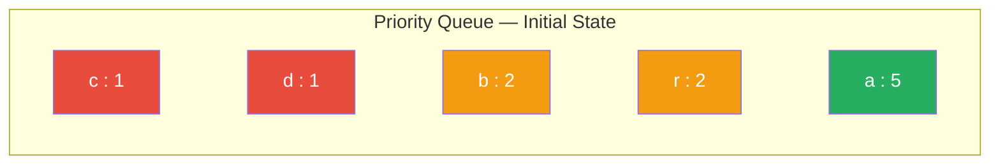
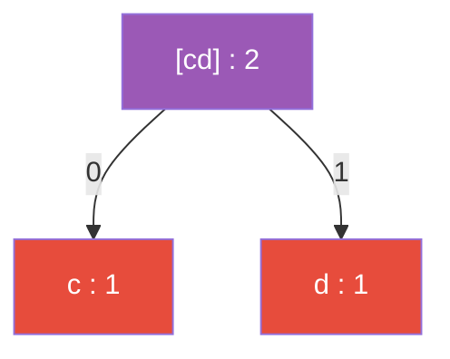
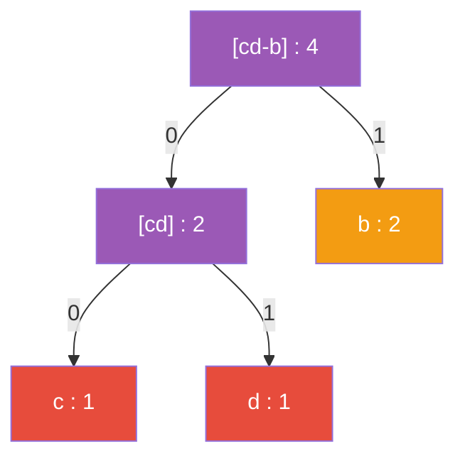
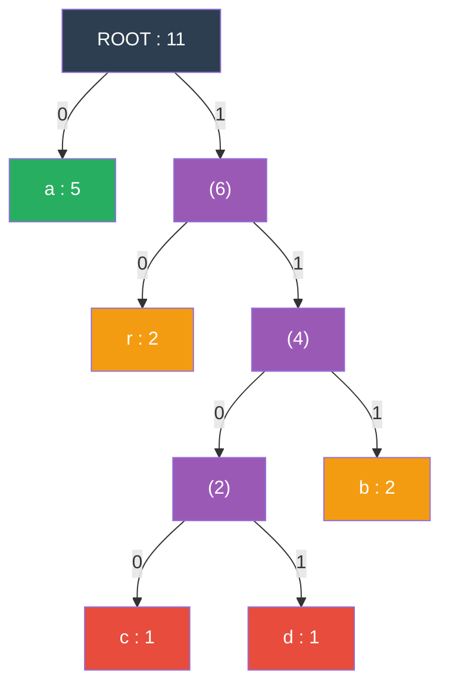
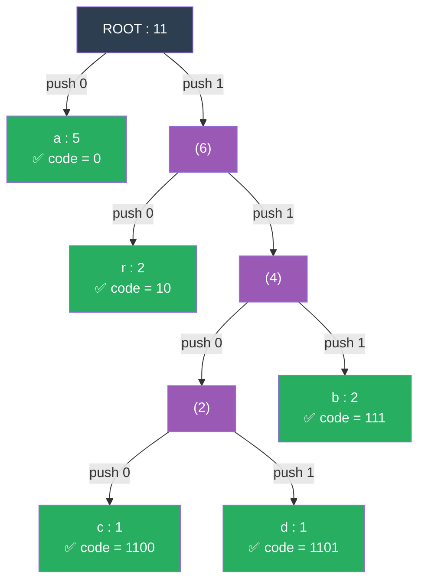
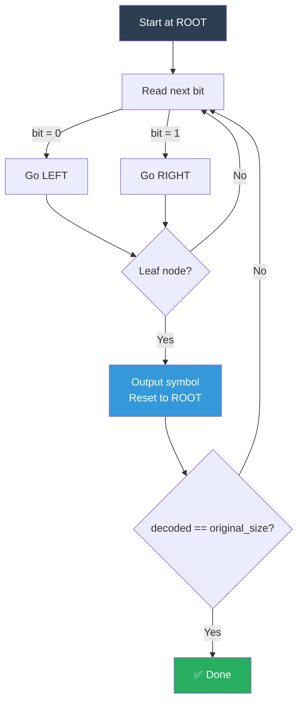
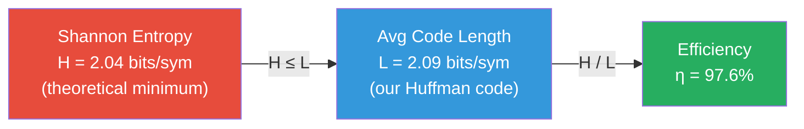

# Huffman Coding Algorithm

This document explains the Huffman coding algorithm as implemented in Pufferfish.

All examples use the string **`"abracadabra"`** for consistency with [explanation.md](explanation.md).

## Overview

Huffman coding is a **lossless compression** algorithm invented by David Huffman in 1952. It assigns **variable-length binary codes** to symbols based on their frequencies: frequent symbols get short codes, rare symbols get long codes.

The algorithm is **greedy** — at each step, it makes the locally optimal choice (merging the two least frequent nodes), which leads to a globally optimal solution.


## Step 1: Frequency Analysis

Read the input and count how many times each byte value appears.

**Example input:** `"abracadabra"` (11 bytes)

| Symbol | ASCII Value | Frequency | Probability |
|:------:|:-----------:|:---------:|:-----------:|
| `a`    | 97          | 5         | 45.5%       |
| `b`    | 98          | 2         | 18.2%       |
| `r`    | 114         | 2         | 18.2%       |
| `c`    | 99          | 1         | 9.1%        |
| `d`    | 100         | 1         | 9.1%        |

## Step 2: Build the Huffman Tree

Use a **priority queue (min-heap)** to construct a binary tree:

1. Create a leaf node for each symbol with its frequency.
2. **Sort by symbol ascending** before inserting into the min-heap (ensures deterministic push order regardless of `unordered_map` iteration order).
3. Insert all leaves into the min-heap (smallest frequency = highest priority).
4. While the heap has more than one node:
   - Extract the two nodes with the smallest frequencies.
   - When frequencies are tied, the node with the smaller `symbol` value has higher priority. Internal nodes always have `symbol = 0`, so they are always prioritized over leaf nodes in a tie.
   - Create a new internal node with these two as children and frequency = sum.
   - Insert the new node back into the heap.
5. The last remaining node is the **root** of the Huffman tree.

### Comparator

The priority queue uses a custom comparator:

```
Primary:     lower frequency  → higher priority
Tie-breaker: lower symbol     → higher priority
```

Internal nodes (created by merging) always have `symbol = 0`. This means that when an internal node and a leaf node have the same frequency, the internal node is extracted first.

### Construction Trace for `"abracadabra"`

**Initial priority queue** (sorted by frequency, then symbol):



---

**Step 1:** Extract `c(1)` and `d(1)` — two lowest frequency. Merge → `[cd](2, sym=0)`.



```text
Queue: [cd](2, sym=0),  b(2, sym=98),  r(2, sym=114),  a(5, sym=97)
                  ↑               ↑
          sym=0 wins tie     sym=98 < sym=114
```

---

**Step 2:** Extract `[cd](2, sym=0)` and `b(2, sym=98)` — tied freq=2, `[cd]` wins because `sym=0 < sym=98`.



```text
Queue: r(2, sym=114),  [cd-b](4, sym=0),  a(5, sym=97)
```

---

**Step 3:** Extract `r(2)` and `[cd-b](4)` — `r` has the lowest frequency.

```text
Queue: a(5, sym=97),  [r-cdb](6, sym=0)
```

---

**Step 4 (Final):** Extract `a(5)` and `[r-cdb](6)` — merge into **ROOT(11)**.



### Why is this greedy?

At each step, we merge the two **cheapest** nodes — the ones with the lowest frequency. This greedy choice ensures that high-frequency symbols end up near the root (getting short codes) and low-frequency symbols end up deeper (getting longer codes).

### Properties of the tree

- It is a **full binary tree**: every internal node has exactly two children.
- With `n` unique symbols, the tree has `2n - 1` total nodes. (For `"abracadabra"`: 5 leaves + 4 internal = 9 total = 2×5 − 1 ✓)
- The tree **height** equals the longest code length. (Height = 5, longest code = 4 bits for `c` and `d`)

## Step 3: Generate Codes

Traverse the tree recursively (DFS, depth-first search):
- Going **left** → append `0`
- Going **right** → append `1`
- Reaching a **leaf** → the accumulated bits are that symbol's code



**Generated codes for `"abracadabra"`:**

| Symbol | Path from Root                | Code   | Length |
|:------:|:------------------------------|:------:|:------:|
| `a`    | left                          | `0`    | 1 bit  |
| `r`    | right → left                  | `10`   | 2 bits |
| `b`    | right → right → right         | `111`  | 3 bits |
| `c`    | right → right → left → left   | `1100` | 4 bits |
| `d`    | right → right → left → right  | `1101` | 4 bits |

### The Prefix Property

No code is a prefix of any other code. For example, `0` (the code for `a`) is not a prefix of `10`, `111`, `1100`, or `1101`. This is guaranteed by the tree structure — codes only exist at leaves, and no leaf is an ancestor of another leaf.

This property makes decoding **unambiguous**: there is exactly one way to parse a Huffman-encoded bitstream.

## Step 4: Encoding

Replace each input byte with its Huffman code:

```text
Input:   a    b    r    a    c      a    d      a    b    r    a
Codes:   0    111  10   0    1100   0    1101   0    111  10   0
```

**Encoded bitstream:** `0 111 10 0 1100 0 1101 0 111 10 0` = **23 bits**

Original size: 11 bytes = 88 bits.

The bits are packed into bytes for storage (MSB-first). If the total number of bits is not a multiple of 8, the last byte is padded with zeros and the padding count is stored in the archive.

```text
Byte 1: 0 1 1 1 1 0 0 1  = 0x79
Byte 2: 1 0 0 0 1 1 0 1  = 0x8D
Byte 3: 0 1 1 1 1 0 0 _  = 0x78  (1 bit padding)
```

## Step 5: Decoding

Start at the root of the Huffman tree. For each bit in the stream:
- `0` → go **left**
- `1` → go **right**
- When you reach a **leaf** → output that symbol, go back to the root



**Decoding trace (first 7 symbols):**

```text
Bit 0 → root left → LEAF 'a' → output 'a', restart
Bit 1 → root right → (6)
Bit 1 →   (6) right → (4)
Bit 1 →   (4) right → LEAF 'b' → output 'b', restart
Bit 1 → root right → (6)
Bit 0 →   (6) left → LEAF 'r' → output 'r', restart
Bit 0 → root left → LEAF 'a' → output 'a', restart
Bit 1 → root right → (6)
Bit 1 →   (6) right → (4)
Bit 0 →   (4) left → (2)
Bit 0 →   (2) left → LEAF 'c' → output 'c', restart
...
Result so far: "abrac..."  → continues until decoded == original_size (11)
```

We stop after decoding the expected number of bytes (original file size), which avoids interpreting the padding bits at the end.

## Information Theory

### Shannon Entropy

The **Shannon entropy** of a source is defined as:

$$H = -\sum_{x \in X} p(x) \cdot \log_2 p(x)$$

where $p(x)$ is the probability of symbol $x$. This gives the **theoretical minimum** average bits per symbol — no coding scheme can do better.

**Calculation for `"abracadabra"`:**

| Symbol | $p(x)$   | $\log_2 p(x)$ | $-p(x) \cdot \log_2 p(x)$ |
|:------:|:--------:|:--------------:|:--------------------------:|
| `a`    | 5/11 = 0.4545 | −1.138    | 0.517                      |
| `b`    | 2/11 = 0.1818 | −2.459    | 0.447                      |
| `r`    | 2/11 = 0.1818 | −2.459    | 0.447                      |
| `c`    | 1/11 = 0.0909 | −3.459    | 0.314                      |
| `d`    | 1/11 = 0.0909 | −3.459    | 0.314                      |
|        |          | **Total H** | **≈ 2.04 bits/symbol**     |

### Average Code Length

The **average code length** of a Huffman code is:

$$L = \sum_{x \in X} p(x) \cdot |code(x)|$$

**Calculation for `"abracadabra"`:**

| Symbol | $p(x)$  | $|code(x)|$ | $p(x) \cdot |code(x)|$ |
|:------:|:-------:|:-----------:|:----------------------:|
| `a`    | 5/11    | 1           | 5/11 = 0.455           |
| `b`    | 2/11    | 3           | 6/11 = 0.545           |
| `r`    | 2/11    | 2           | 4/11 = 0.364           |
| `c`    | 1/11    | 4           | 4/11 = 0.364           |
| `d`    | 1/11    | 4           | 4/11 = 0.364           |
|        |         | **Total L** | **= 23/11 ≈ 2.09 bits/symbol** |

### Compression Efficiency

$$\eta = \frac{H}{L} \times 100\% = \frac{2.04}{2.09} \times 100\% \approx 97.6\%$$

Huffman coding guarantees: $H \leq L < H + 1$. The average code length is always within 1 bit of the entropy, making Huffman coding near-optimal for symbol-by-symbol encoding.


