# Penjelasan Kode Pufferfish — Lengkap & Detail

Dokumen ini menjelaskan **keseluruhan kode** proyek Pufferfish secara mendetail, mulai dari arsitektur, alur kerja (flow), hingga penjelasan sintaks C++ baris per baris.

Seluruh penjelasan menggunakan string **`"abracadabra"`** sebagai contoh yang konsisten.

---

## Daftar Isi

1. [Arsitektur & Struktur Proyek](#1-arsitektur--struktur-proyek)
2. [Sistem Build — CMakeLists.txt](#2-sistem-build--cmakeliststxt)
3. [Alur Kerja Keseluruhan (Flow)](#3-alur-kerja-keseluruhan-flow)
4. [Module 1: Huffman Core — huffman.hpp & huffman.cpp](#4-module-1-huffman-core)
   - 4.1 [Type Aliases](#41-type-aliases)
   - 4.2 [HuffmanNode (Struktur Data Node)](#42-huffmannode)
   - 4.3 [HuffmanTree (Konstruksi Pohon)](#43-huffmantree)
   - 4.4 [BitWriter & BitReader (I/O Bit-Level)](#44-bitwriter--bitreader)
   - 4.5 [Encoder & Decoder](#45-encoder--decoder)
5. [Module 2: Archive — archive.hpp & archive.cpp](#5-module-2-archive)
   - 5.1 [Format Biner .puff](#51-format-biner-puff)
   - 5.2 [Helper Fungsi Serialisasi](#52-helper-fungsi-serialisasi)
   - 5.3 [ArchiveWriter::compress()](#53-archivewritercompress)
   - 5.4 [ArchiveReader::extract()](#54-archivereaderextract)
6. [Module 3: Statistics — statistics.hpp & statistics.cpp](#6-module-3-statistics)
   - 6.1 [AnalysisResult (Struktur Data Hasil)](#61-analysisresult)
   - 6.2 [Statistics::analyze()](#62-statisticsanalyze)
   - 6.3 [Statistics::print_report()](#63-statisticsprint_report)
7. [Module 4: CLI Entry Point — main.cpp](#7-module-4-cli-entry-point)
8. [Konsep Matematika dalam Kode](#8-konsep-matematika-dalam-kode)
9. [Glossary Sintaks C++ yang Digunakan](#9-glossary-sintaks-c-yang-digunakan)

---

## Contoh yang Digunakan: `"abracadabra"`

Sepanjang dokumen ini, kita akan menggunakan string **`"abracadabra"`** (11 karakter) sebagai contoh.

### Tabel Frekuensi

| Simbol | Frekuensi | Persentase |
| :---: | :---: | :---: |
| `a` | 5 | 45.5% |
| `b` | 2 | 18.2% |
| `r` | 2 | 18.2% |
| `c` | 1 | 9.1% |
| `d` | 1 | 9.1% |

**Total:** 11 simbol, **5 simbol unik**

---

## 1. Arsitektur & Struktur Proyek

```text
pufferfish/
├── CMakeLists.txt              ← Konfigurasi build (CMake)
├── include/                    ← Header files (deklarasi interface)
│   ├── huffman.hpp             ← Deklarasi Node, Tree, BitIO, Encoder, Decoder
│   ├── archive.hpp             ← Deklarasi ArchiveWriter & ArchiveReader
│   └── statistics.hpp          ← Deklarasi Statistics & AnalysisResult
├── src/                        ← Source files (implementasi)
│   ├── huffman.cpp             ← Implementasi seluruh isi huffman.hpp
│   ├── archive.cpp             ← Implementasi compress & extract
│   ├── statistics.cpp          ← Implementasi analyze & print_report
│   └── main.cpp                ← Entry point CLI (fungsi main)
├── docs/                       ← Dokumentasi
└── samples/                    ← File contoh untuk pengujian
```

### Prinsip Desain

| Prinsip | Penerapan |
| :--- | :--- |
| **Separation of Concerns** | Setiap modul punya tanggung jawab tunggal |
| **Header/Source Split** | `.hpp` berisi deklarasi (apa), `.cpp` berisi implementasi (bagaimana) |
| **Namespace** | Seluruh kode berada dalam `namespace pufferfish` untuk menghindari konflik nama |
| **Include Guard** | Setiap `.hpp` menggunakan `#ifndef`/`#define`/`#endif` agar tidak di-include dua kali |

### Diagram Dependensi Antar Modul

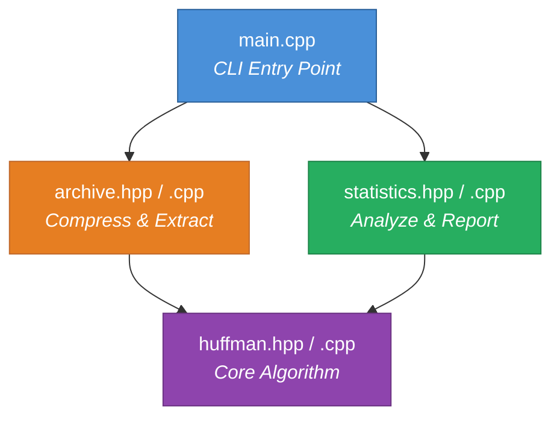

`huffman.hpp` adalah **fondasi** — semua modul lain bergantung padanya, tapi dia sendiri tidak bergantung pada modul lain.

---

## 2. Sistem Build — CMakeLists.txt

```cmake
cmake_minimum_required(VERSION 3.16)
project(pufferfish VERSION 1.0.0 LANGUAGES CXX)

set(CMAKE_CXX_STANDARD 20)
set(CMAKE_CXX_STANDARD_REQUIRED ON)

include_directories(include)

add_executable(puff
    src/huffman.cpp
    src/archive.cpp
    src/statistics.cpp
    src/main.cpp
)
```

### Penjelasan Baris per Baris

| Baris | Penjelasan |
| :--- | :--- |
| `cmake_minimum_required(VERSION 3.16)` | Menetapkan versi minimum CMake yang dibutuhkan. Versi 3.16 mendukung C++20. |
| `project(pufferfish VERSION 1.0.0 LANGUAGES CXX)` | Mendefinisikan nama proyek, versi semantik, dan bahasa yang digunakan (C++). |
| `set(CMAKE_CXX_STANDARD 20)` | Menggunakan standar C++20. Diperlukan untuk fitur seperti `std::optional`, structured bindings, dan `[[nodiscard]]`. |
| `set(CMAKE_CXX_STANDARD_REQUIRED ON)` | Jika compiler tidak mendukung C++20, build akan **gagal** (bukan fallback ke versi lama). |
| `include_directories(include)` | Menambahkan folder `include/` ke search path, sehingga `#include "huffman.hpp"` bisa ditemukan oleh compiler. |
| `add_executable(puff ...)` | Mendefinisikan target executable bernama `puff` dari 4 file `.cpp`. CMake akan mengompilasi setiap `.cpp` menjadi *object file* lalu *link* menjadi satu executable. |

---

## 3. Alur Kerja Keseluruhan (Flow)

### 3.1 Flow Compress

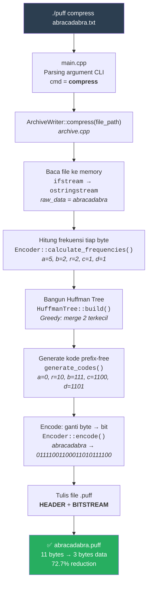

### 3.2 Flow Extract

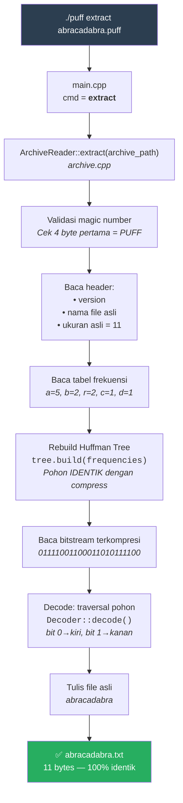

### 3.3 Flow Analyze

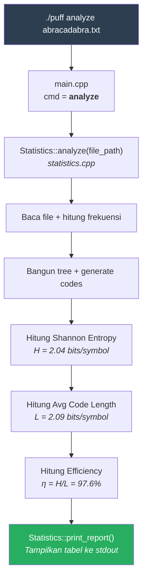

---

## 4. Module 1: Huffman Core

File: `include/huffman.hpp` (deklarasi) + `src/huffman.cpp` (implementasi)

Modul ini berisi **seluruh inti algoritma Huffman Coding**. Ini adalah jantung proyek.

---

### 4.1 Type Aliases

```cpp
using ByteFrequencyMap = std::unordered_map<uint8_t, uint64_t>;
using HuffmanCodeMap   = std::unordered_map<uint8_t, std::vector<bool>>;
```

| Alias | Tipe Asli | Kegunaan |
| :--- | :--- | :--- |
| `ByteFrequencyMap` | `unordered_map<uint8_t, uint64_t>` | Memetakan setiap byte (0–255) ke berapa kali dia muncul. |
| `HuffmanCodeMap` | `unordered_map<uint8_t, vector<bool>>` | Memetakan setiap byte ke kode Huffman-nya (deretan bit). |

**Contoh `"abracadabra"`:**

```text
ByteFrequencyMap:
  'a' (97)  → 5
  'b' (98)  → 2
  'r' (114) → 2
  'c' (99)  → 1
  'd' (100) → 1

HuffmanCodeMap:
  'a' (97)  → [0]              = "0"
  'r' (114) → [1,0]            = "10"
  'b' (98)  → [1,1,1]          = "111"
  'c' (99)  → [1,1,0,0]        = "1100"
  'd' (100) → [1,1,0,1]        = "1101"
```

**Mengapa `uint8_t`?** Karena satu byte memiliki 256 kemungkinan nilai (0–255). Tipe `uint8_t` mewakili ini secara tepat.

**Mengapa `vector<bool>`?** Karena kode Huffman memiliki panjang variabel (bukan kelipatan 8). `vector<bool>` memungkinkan kita menyimpan urutan bit dengan panjang berapa pun.

**Mengapa `unordered_map`?** Karena pencarian $O(1)$ rata-rata, dibandingkan `std::map` yang $O(\log n)$.

---

### 4.2 HuffmanNode

#### Deklarasi (huffman.hpp)

```cpp
struct HuffmanNode {
    uint8_t  symbol    = 0;
    uint64_t frequency = 0;
    std::unique_ptr<HuffmanNode> left;
    std::unique_ptr<HuffmanNode> right;

    HuffmanNode(uint8_t sym, uint64_t freq);
    HuffmanNode(std::unique_ptr<HuffmanNode> l, std::unique_ptr<HuffmanNode> r);
    [[nodiscard]] bool is_leaf() const noexcept;
};
```

#### Penjelasan Field

| Field | Tipe | Penjelasan |
| :--- | :--- | :--- |
| `symbol` | `uint8_t` | Byte yang diwakili node ini. Hanya bermakna untuk **leaf node**. Internal node selalu `symbol = 0`. |
| `frequency` | `uint64_t` | Jumlah kemunculan. Untuk internal node = **jumlah frekuensi kedua anak**. |
| `left` | `unique_ptr<HuffmanNode>` | Anak kiri (mewakili bit `0`). `nullptr` jika leaf. |
| `right` | `unique_ptr<HuffmanNode>` | Anak kanan (mewakili bit `1`). `nullptr` jika leaf. |

**Contoh `"abracadabra"` — Jenis Node:**

```text
LEAF NODE:       HuffmanNode('a', 5)     → symbol=97, freq=5, left=null, right=null
INTERNAL NODE:   HuffmanNode(left, right) → symbol=0,  freq=left.freq+right.freq
```

#### Implementasi (huffman.cpp)

```cpp
// Constructor untuk LEAF NODE (node daun)
HuffmanNode::HuffmanNode(uint8_t sym, uint64_t freq)
    : symbol(sym), frequency(freq) {}
```

**Sintaks `: symbol(sym), frequency(freq)`** — Ini adalah *member initializer list*. Alih-alih meng-assign di body constructor, kita langsung menginisialisasi member pada saat konstruksi. Ini lebih efisien karena menghindari default-construction lalu assignment.

```cpp
// Constructor untuk INTERNAL NODE (node percabangan)
HuffmanNode::HuffmanNode(std::unique_ptr<HuffmanNode> l, std::unique_ptr<HuffmanNode> r)
    : symbol(0), frequency(l->frequency + r->frequency),
      left(std::move(l)), right(std::move(r)) {}
```

**`std::move(l)`** — `unique_ptr` tidak bisa di-copy (kepemilikan tunggal). `std::move` mentransfer kepemilikan dari parameter ke member. Setelah move, `l` menjadi `nullptr`.

**`l->frequency + r->frequency`** — Frekuensi internal node = jumlah kedua anak. Ini properti fundamental Huffman Tree.

**Contoh:** Saat menggabungkan `c(1)` dan `d(1)` → internal node dengan `frequency = 1 + 1 = 2`.

```cpp
bool HuffmanNode::is_leaf() const noexcept {
    return !left && !right;
}
```

**`const noexcept`** — `const` = tidak mengubah state objek. `noexcept` = tidak melempar exception, compiler bisa optimasi lebih agresif.

**`[[nodiscard]]`** (di deklarasi) — Atribut C++17 yang memaksa pemanggil menggunakan return value.

---

### 4.3 HuffmanTree

#### `build()` — Konstruksi Pohon (Greedy Algorithm + Priority Queue)

Ini adalah **fungsi terpenting** di seluruh proyek. Mengimplementasikan **greedy algorithm** menggunakan **min-heap (priority queue)**.

##### Contoh Langkah-demi-Langkah dengan `"abracadabra"`

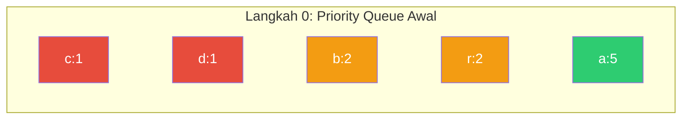

**Langkah 1:** Ambil 2 terkecil: `c(1)` dan `d(1)` → gabungkan menjadi `[cd](2)`

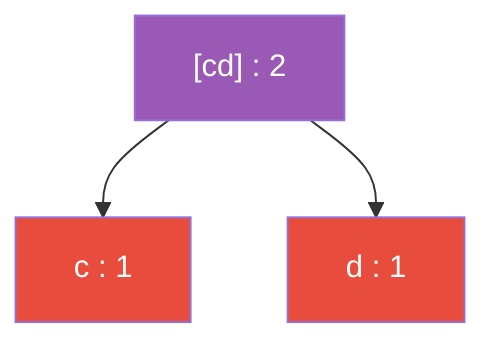

```text
Queue: [cd](2,sym=0), b(2,sym=98), r(2,sym=114), a(5,sym=97)
```

**Langkah 2:** Ambil 2 terkecil: `[cd](2)` dan `b(2)` → gabungkan menjadi `[cd-b](4)`

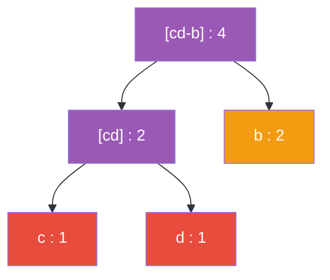

```text
Queue: r(2), [cd-b](4), a(5)
```

**Langkah 3:** Ambil 2 terkecil: `r(2)` dan `[cd-b](4)` → gabungkan menjadi `[r-cdb](6)`

```text
Queue: a(5), [r-cdb](6)
```

**Langkah 4 (Final):** Ambil 2 terkecil: `a(5)` dan `[r-cdb](6)` → gabungkan menjadi **ROOT** `(11)`

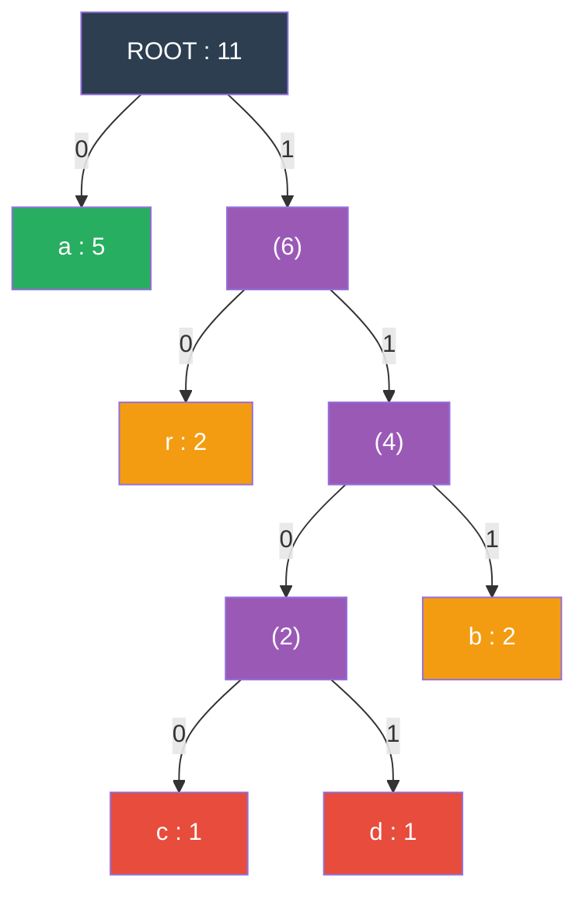

**Hasil Kode Huffman (baca jalur dari root ke leaf):**

| Simbol | Jalur | Kode | Panjang |
| :---: | :--- | :---: | :---: |
| `a` | kiri | `0` | 1 bit |
| `r` | kanan → kiri | `10` | 2 bit |
| `b` | kanan → kanan → kanan | `111` | 3 bit |
| `c` | kanan → kanan → kiri → kiri | `1100` | 4 bit |
| `d` | kanan → kanan → kiri → kanan | `1101` | 4 bit |

**Perhatikan:** Simbol paling sering (`a`, 45.5%) mendapat kode terpendek (1 bit), sementara simbol paling jarang (`c`, `d`, 9.1%) mendapat kode terpanjang (4 bit). **Inilah inti dari Huffman Coding.**

##### Kode `build()` — Penjelasan Baris per Baris

```cpp
void HuffmanTree::build(const ByteFrequencyMap& frequencies) {
    // Base case: jika tidak ada simbol, pohon kosong
    if (frequencies.empty()) {
        root_ = nullptr;
        return;
    }
```

```cpp
    // COMPARATOR untuk priority queue (min-heap)
    // std::priority_queue C++ secara default adalah MAX-heap,
    // jadi kita MEMBALIK perbandingan (a > b) agar jadi MIN-heap
    auto cmp = [](const std::unique_ptr<HuffmanNode>& a,
                  const std::unique_ptr<HuffmanNode>& b) {
        // Prioritas utama: frekuensi LEBIH KECIL = prioritas LEBIH TINGGI
        if (a->frequency != b->frequency) return a->frequency > b->frequency;
        // Tie-breaker: jika frekuensi sama, symbol LEBIH KECIL duluan
        return a->symbol > b->symbol;
    };
```

**Lambda `[](...)  { ... }`** — Fungsi anonim yang didefinisikan inline. `[]` = *capture list* kosong (tidak menangkap variabel luar).

**Mengapa `a > b` bukan `a < b`?** — `std::priority_queue` default = **max-heap** (terbesar di atas). Untuk mendapat **min-heap** (terkecil di atas), kita balik.

**Contoh tie-breaking dengan `"abracadabra"`:**
- `b(freq=2, sym=98)` vs `r(freq=2, sym=114)` → frekuensi sama → sym 98 < 114 → `b` punya prioritas lebih tinggi dari `r`.

```cpp
    // Deklarasi priority queue dengan custom comparator
    std::priority_queue<
        std::unique_ptr<HuffmanNode>,              // Tipe elemen
        std::vector<std::unique_ptr<HuffmanNode>>,  // Container internal
        decltype(cmp)                               // Tipe comparator
    > pq(cmp);
```

**`decltype(cmp)`** — Keyword C++11 yang menghasilkan tipe dari ekspresi `cmp`. Lambda memiliki tipe unik yang tidak bisa ditulis manual, jadi gunakan `decltype`.

```cpp
    // FIX DETERMINISME: Salin ke vector dan sort berdasarkan symbol
    // SEBELUM push ke priority queue.
    //
    // MENGAPA? unordered_map tidak menjamin urutan iterasi.
    // Saat compress: map diisi dari scan file (urutan kemunculan pertama).
    // Saat extract: map diisi dari header arsip (urutan berbeda).
    // Urutan push berbeda → tie-breaking internal node berbeda → pohon BERBEDA
    // → decode gagal!
    std::vector<std::pair<uint8_t, uint64_t>> sorted_freq(
        frequencies.begin(), frequencies.end()
    );
    std::sort(sorted_freq.begin(), sorted_freq.end(),
              [](const auto& a, const auto& b) { return a.first < b.first; });
```

**Contoh `"abracadabra"`:**

```text
SEBELUM sort (dari unordered_map, urutan ACAK):
  [('r',2), ('a',5), ('d',1), ('b',2), ('c',1)]   ← bisa berbeda tiap kali!

SESUDAH sort (berdasarkan symbol ascending):
  [('a',5), ('b',2), ('c',1), ('d',1), ('r',2)]    ← SELALU urutan ini
```

```cpp
    // Push semua leaf node ke priority queue (dalam urutan deterministik)
    for (const auto& [sym, freq] : sorted_freq) {
        pq.push(std::make_unique<HuffmanNode>(sym, freq));
    }
```

**`const auto& [sym, freq]`** — *Structured binding* (C++17). Decompose `std::pair` menjadi dua variabel.

**`std::make_unique<HuffmanNode>(sym, freq)`** — Membuat `unique_ptr<HuffmanNode>` baru di heap. Lebih aman dan efisien daripada `new`.

```cpp
    // === INTI ALGORITMA GREEDY ===
    // Ulangi sampai tersisa satu node (root):
    //   1. Ambil 2 node dengan frekuensi terkecil
    //   2. Gabungkan menjadi satu internal node baru
    //   3. Masukkan kembali ke priority queue
    while (pq.size() > 1) {
        auto left  = std::move(const_cast<std::unique_ptr<HuffmanNode>&>(pq.top()));
        pq.pop();
        auto right = std::move(const_cast<std::unique_ptr<HuffmanNode>&>(pq.top()));
        pq.pop();
        pq.push(std::make_unique<HuffmanNode>(std::move(left), std::move(right)));
    }
```

**Mengapa `const_cast`?** — `pq.top()` return `const&`, tapi kita perlu `std::move`. `const_cast` menghapus `const`. Aman karena langsung `pop()` setelahnya.

**Greedy Choice:** Setiap iterasi **selalu** mengambil 2 node terkecil. Ini terbukti secara matematis menghasilkan kode **optimal**.

**Trace `"abracadabra"` (ringkasan):**

```text
Queue awal:     c(1) d(1) b(2) r(2) a(5)       ← 5 node
Iterasi 1:      [cd](2) b(2) r(2) a(5)          ← 4 node, gabung c+d
Iterasi 2:      r(2) [cd-b](4) a(5)             ← 3 node, gabung [cd]+b
Iterasi 3:      a(5) [r-cdb](6)                 ← 2 node, gabung r+[cd-b]
Iterasi 4:      ROOT(11)                         ← 1 node, gabung a+[r-cdb]
```

```cpp
    // Node terakhir yang tersisa adalah ROOT
    root_ = std::move(const_cast<std::unique_ptr<HuffmanNode>&>(pq.top()));
    pq.pop();
}
```

---

#### `generate_codes()` — Menghasilkan Kode Prefix-Free

```cpp
HuffmanCodeMap HuffmanTree::generate_codes() const {
    HuffmanCodeMap codes;
    if (!root_) return codes;

    std::vector<bool> current_code;

    // Edge case: pohon hanya 1 leaf (1 simbol unik, misal: "aaaa")
    if (root_->is_leaf()) {
        codes[root_->symbol] = {false};  // false = bit 0
        return codes;
    }

    generate_codes_impl(root_.get(), current_code, codes);
    return codes;
}
```

**`root_.get()`** — `unique_ptr::get()` return raw pointer tanpa melepas kepemilikan. Fungsi rekursif hanya perlu *observe*.

```cpp
// Fungsi rekursif DFS (Depth-First Search) untuk traversal pohon
void HuffmanTree::generate_codes_impl(
    const HuffmanNode* node,
    std::vector<bool>& current_code,
    HuffmanCodeMap& codes
) {
    if (!node) return;

    // Jika mencapai leaf node, simpan kode saat ini
    if (node->is_leaf()) {
        codes[node->symbol] = current_code;
        return;
    }

    // Traversal ke KIRI = tambahkan bit 0
    current_code.push_back(false);
    generate_codes_impl(node->left.get(), current_code, codes);
    current_code.pop_back();  // Backtrack

    // Traversal ke KANAN = tambahkan bit 1
    current_code.push_back(true);
    generate_codes_impl(node->right.get(), current_code, codes);
    current_code.pop_back();  // Backtrack
}
```

**Teknik Backtracking:** `push_back` menambah bit sebelum masuk subtree, `pop_back` menghapusnya setelah kembali. `current_code` selalu berisi jalur dari root ke node saat ini.

**Trace DFS pada pohon `"abracadabra"`:**

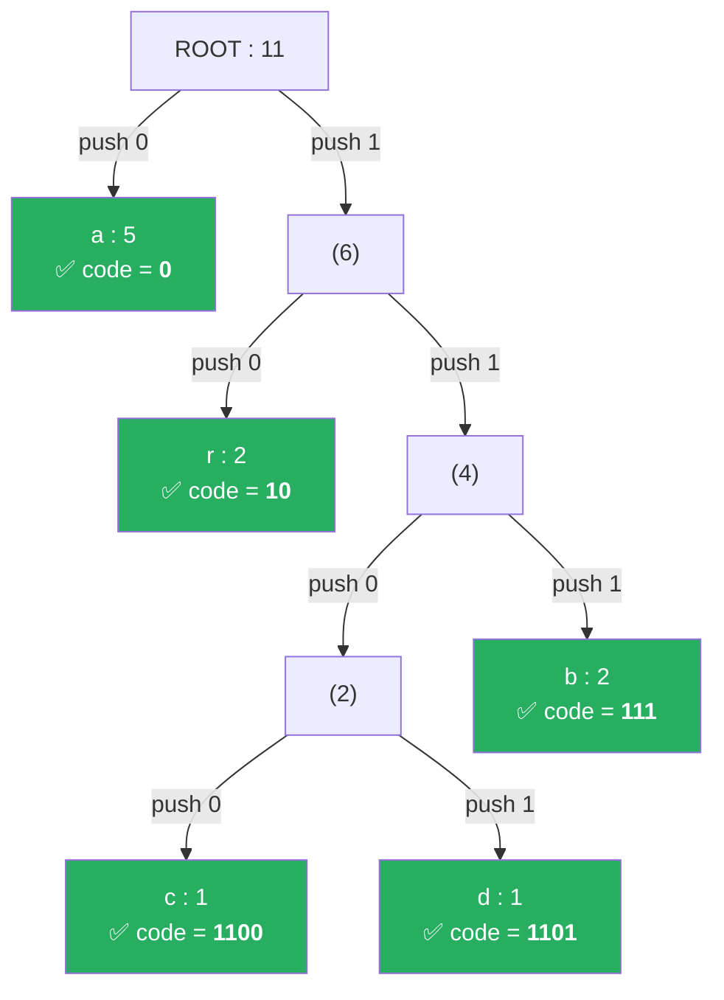

```text
Traversal DFS (depth-first, left-first):

1. ROOT → kiri → LEAF 'a'
   current_code = [0]
   codes['a'] = [0]  ← simpan
   pop_back → current_code = []

2. ROOT → kanan → (6) → kiri → LEAF 'r'
   current_code = [1, 0]
   codes['r'] = [1,0]  ← simpan
   pop_back → current_code = [1]

3. ROOT → kanan → (6) → kanan → (4) → kiri → (2) → kiri → LEAF 'c'
   current_code = [1, 1, 0, 0]
   codes['c'] = [1,1,0,0]  ← simpan
   pop_back → current_code = [1, 1, 0]

4. ROOT → kanan → (6) → kanan → (4) → kiri → (2) → kanan → LEAF 'd'
   current_code = [1, 1, 0, 1]
   codes['d'] = [1,1,0,1]  ← simpan
   pop_back → current_code = [1, 1, 0]
   pop_back → current_code = [1, 1]

5. ROOT → kanan → (6) → kanan → (4) → kanan → LEAF 'b'
   current_code = [1, 1, 1]
   codes['b'] = [1,1,1]  ← simpan
```

**Properti Prefix-Free:** Kode hanya di-assign ke **leaf node**. Tidak ada leaf yang merupakan ancestor dari leaf lain → tidak ada kode yang merupakan prefix dari kode lain → **decoding unambiguous**.

---

#### Fungsi Utilitas Pohon

```cpp
int HuffmanTree::height_impl(const HuffmanNode* node) noexcept {
    if (!node) return 0;
    if (node->is_leaf()) return 1;
    return 1 + std::max(height_impl(node->left.get()),
                        height_impl(node->right.get()));
}

int HuffmanTree::node_count_impl(const HuffmanNode* node) noexcept {
    if (!node) return 0;
    return 1 + node_count_impl(node->left.get())
             + node_count_impl(node->right.get());
}
```

**Contoh `"abracadabra"`:**
- **Tinggi** = 5 (jalur terpanjang: ROOT → (6) → (4) → (2) → c/d)
- **Jumlah node** = 9 (5 leaf + 4 internal)

---

### 4.4 BitWriter & BitReader

Kode Huffman punya panjang variabel (misal 1 bit, 3 bit, 4 bit). File hanya bisa menyimpan **byte** (8 bit). Kelas ini menjembatani gap tersebut.

#### BitWriter — Menulis Bit per Bit ke Output Stream

```cpp
class BitWriter {
private:
    std::ostream& out_;          // Reference ke output stream
    uint8_t  buffer_     = 0;    // Buffer 8-bit yang sedang diisi
    int      bit_count_  = 0;    // Berapa bit sudah terisi
    uint64_t bytes_written_ = 0; // Counter total byte yang ditulis
};
```

```cpp
void BitWriter::write_bit(bool bit) {
    // Geser buffer ke kiri 1 posisi, masukkan bit baru di LSB
    buffer_ = static_cast<uint8_t>((buffer_ << 1) | (bit ? 1 : 0));
    ++bit_count_;

    // Jika buffer penuh (8 bit), tulis ke stream
    if (bit_count_ == 8) {
        out_.put(static_cast<char>(buffer_));
        ++bytes_written_;
        buffer_    = 0;
        bit_count_ = 0;
    }
}
```

**Contoh `"abracadabra"` — Proses Encoding ke Bit:**

```text
Input:  a      b      r      a      c         a      d         a      b      r      a
Kode:   0      111    10     0      1100      0      1101      0      111    10     0
Bits:   0      111    10     0      1100      0      1101      0      111    10     0
```

**Visualisasi proses buffer byte-per-byte:**

```text
Bitstream lengkap: 0 1 1 1 1 0 0 1 | 1 0 0 0 1 1 0 1 | 0 1 1 1 1 0 0 [pad]
                   ─────────────────  ─────────────────  ─────────────────────
                       Byte 1             Byte 2             Byte 3
                       = 0x79             = 0x8D             = 0x78 (1 bit pad)

Buffer step-by-step untuk Byte 1:
  bit 0: buffer = 00000000  →  (0 << 1) | 0 = 00000000  (bit_count=1)
  bit 1: buffer = 00000000  →  (0 << 1) | 1 = 00000001  (bit_count=2)
  bit 1: buffer = 00000001  →  (1 << 1) | 1 = 00000011  (bit_count=3)
  bit 1: buffer = 00000011  →  (3 << 1) | 1 = 00000111  (bit_count=4)
  bit 1: buffer = 00000111  →  (7 << 1) | 1 = 00001111  (bit_count=5)
  bit 0: buffer = 00001111  →  (15<< 1) | 0 = 00011110  (bit_count=6)
  bit 0: buffer = 00011110  →  (30<< 1) | 0 = 00111100  (bit_count=7)
  bit 1: buffer = 00111100  →  (60<< 1) | 1 = 01111001  (bit_count=8) → TULIS!
  Byte 1 = 0x79 = 01111001
```

```cpp
uint8_t BitWriter::flush() {
    if (bit_count_ == 0) return 0;  // Tidak ada sisa bit
    uint8_t padding = static_cast<uint8_t>(8 - bit_count_);
    buffer_ = static_cast<uint8_t>(buffer_ << padding);
    out_.put(static_cast<char>(buffer_));
    ++bytes_written_;
    buffer_    = 0;
    bit_count_ = 0;
    return padding;
}
```

**Contoh `"abracadabra"` — Flush Byte Terakhir:**

```text
Setelah menulis 23 bit, buffer berisi 7 bit: 0111100
bit_count = 7, padding = 8 - 7 = 1

Geser kiri 1 posisi: 0111100 → 01111000 = 0x78
Tulis 0x78 ke stream.

Hasil: 3 byte terkompresi: [0x79, 0x8D, 0x78]
padding_bits = 1  (disimpan di header .puff agar decoder tahu 1 bit terakhir bukan data)
```

#### BitReader — Membaca Bit per Bit dari Input Stream

```cpp
std::optional<bool> BitReader::read_bit() {
    if (bits_remaining_ == 0) {
        char ch;
        if (!in_.get(ch)) return std::nullopt;  // EOF
        buffer_         = static_cast<uint8_t>(ch);
        bits_remaining_ = 8;
    }
    --bits_remaining_;
    return (buffer_ >> bits_remaining_) & 1;
}
```

**`std::optional<bool>`** — Tipe C++17 yang bisa berisi `bool` atau *nothing* (`std::nullopt`). Menandakan EOF dengan elegan.

**Contoh membaca Byte 1 (0x79 = 01111001):**

```text
buffer = 01111001, bits_remaining = 8

read_bit() → bits_remaining=7, (01111001 >> 7) & 1 = 0   ← bit pertama
read_bit() → bits_remaining=6, (01111001 >> 6) & 1 = 1
read_bit() → bits_remaining=5, (01111001 >> 5) & 1 = 1
read_bit() → bits_remaining=4, (01111001 >> 4) & 1 = 1
read_bit() → bits_remaining=3, (01111001 >> 3) & 1 = 1
read_bit() → bits_remaining=2, (01111001 >> 2) & 1 = 0
read_bit() → bits_remaining=1, (01111001 >> 1) & 1 = 0
read_bit() → bits_remaining=0, (01111001 >> 0) & 1 = 1

Hasil: 0,1,1,1,1,0,0,1 ← sama persis dengan yang ditulis!
```

---

### 4.5 Encoder & Decoder

#### Encoder::calculate_frequencies()

```cpp
ByteFrequencyMap Encoder::calculate_frequencies(std::istream& input) {
    ByteFrequencyMap freq;
    char ch;
    while (input.get(ch)) {
        ++freq[static_cast<uint8_t>(ch)];
    }
    return freq;
}
```

**Contoh `"abracadabra"`:**

```text
Baca 'a' → freq = {a:1}
Baca 'b' → freq = {a:1, b:1}
Baca 'r' → freq = {a:1, b:1, r:1}
Baca 'a' → freq = {a:2, b:1, r:1}
Baca 'c' → freq = {a:2, b:1, r:1, c:1}
Baca 'a' → freq = {a:3, b:1, r:1, c:1}
Baca 'd' → freq = {a:3, b:1, r:1, c:1, d:1}
Baca 'a' → freq = {a:4, b:1, r:1, c:1, d:1}
Baca 'b' → freq = {a:4, b:2, r:1, c:1, d:1}
Baca 'r' → freq = {a:4, b:2, r:2, c:1, d:1}
Baca 'a' → freq = {a:5, b:2, r:2, c:1, d:1}  ← HASIL AKHIR
```

**`++freq[static_cast<uint8_t>(ch)]`** — `operator[]` membuat entry baru (value=0) jika key belum ada, lalu `++` menambah 1. Idiom standar C++ untuk frequency counting.

#### Encoder::encode()

```cpp
EncodeResult Encoder::encode(
    std::istream& input, std::ostream& output,
    const HuffmanCodeMap& codes
) {
    BitWriter writer(output);
    char ch;
    while (input.get(ch)) {
        auto it = codes.find(static_cast<uint8_t>(ch));
        if (it != codes.end()) {
            writer.write_bits(it->second);
        }
    }
    uint8_t padding = writer.flush();
    return {writer.bytes_written(), padding};
}
```

**Contoh `"abracadabra"`:**

```text
Baca 'a' → cari codes['a'] = [0]        → tulis bit: 0
Baca 'b' → cari codes['b'] = [1,1,1]    → tulis bit: 1,1,1
Baca 'r' → cari codes['r'] = [1,0]      → tulis bit: 1,0
Baca 'a' → cari codes['a'] = [0]        → tulis bit: 0
Baca 'c' → cari codes['c'] = [1,1,0,0]  → tulis bit: 1,1,0,0
Baca 'a' → cari codes['a'] = [0]        → tulis bit: 0
Baca 'd' → cari codes['d'] = [1,1,0,1]  → tulis bit: 1,1,0,1
Baca 'a' → cari codes['a'] = [0]        → tulis bit: 0
Baca 'b' → cari codes['b'] = [1,1,1]    → tulis bit: 1,1,1
Baca 'r' → cari codes['r'] = [1,0]      → tulis bit: 1,0
Baca 'a' → cari codes['a'] = [0]        → tulis bit: 0

Total: 23 bits → 3 bytes + 1 bit padding
```

**`return {writer.bytes_written(), padding}`** — *Aggregate initialization* C++11. Membuat `EncodeResult` langsung tanpa menyebut nama struct.

#### Decoder::decode()

```cpp
void Decoder::decode(
    std::istream& input, std::ostream& output,
    const HuffmanTree& tree, uint64_t original_size
) {
    if (original_size == 0 || tree.empty()) return;

    const HuffmanNode* root = tree.get_root();
    BitReader reader(input);

    // Edge case: hanya satu simbol unik (misal "aaaa")
    if (root->is_leaf()) {
        for (uint64_t i = 0; i < original_size; ++i) {
            output.put(static_cast<char>(root->symbol));
            reader.read_bit();
        }
        return;
    }

    uint64_t decoded = 0;
    const HuffmanNode* current = root;

    while (decoded < original_size) {
        auto bit = reader.read_bit();
        if (!bit.has_value()) {
            throw std::runtime_error("Unexpected end of bitstream");
        }
        // bit=0 → kiri, bit=1 → kanan
        current = bit.value() ? current->right.get() : current->left.get();
        if (!current) {
            throw std::runtime_error("Invalid Huffman tree path");
        }
        if (current->is_leaf()) {
            output.put(static_cast<char>(current->symbol));
            ++decoded;
            current = root;  // Reset untuk simbol berikutnya
        }
    }
}
```

**Contoh `"abracadabra"` — Trace Decoding:**

```text
Bitstream: 0 1 1 1 1 0 0 1 1 0 0 0 1 1 0 1 0 1 1 1 1 0 0

Decode simbol ke-1:
  bit=0 → ROOT kiri → LEAF 'a' ✅ → output 'a', reset ke ROOT

Decode simbol ke-2:
  bit=1 → ROOT kanan → (6)
  bit=1 → (6) kanan → (4)
  bit=1 → (4) kanan → LEAF 'b' ✅ → output 'b', reset ke ROOT

Decode simbol ke-3:
  bit=1 → ROOT kanan → (6)
  bit=0 → (6) kiri → LEAF 'r' ✅ → output 'r', reset ke ROOT

Decode simbol ke-4:
  bit=0 → ROOT kiri → LEAF 'a' ✅ → output 'a', reset ke ROOT

Decode simbol ke-5:
  bit=1 → ROOT kanan → (6)
  bit=1 → (6) kanan → (4)
  bit=0 → (4) kiri → (2)
  bit=0 → (2) kiri → LEAF 'c' ✅ → output 'c', reset ke ROOT

Decode simbol ke-6:
  bit=0 → ROOT kiri → LEAF 'a' ✅ → output 'a'

Decode simbol ke-7:
  bit=1 → ROOT kanan → (6)
  bit=1 → (6) kanan → (4)
  bit=0 → (4) kiri → (2)
  bit=1 → (2) kanan → LEAF 'd' ✅ → output 'd'

  ... (lanjut sampai decoded = 11 = original_size)

Hasil: a b r a c a d a b r a = "abracadabra" ← IDENTIK! ✅
```

**`original_size`** — Kritis untuk tahu kapan berhenti. Tanpa ini, decoder akan membaca padding bit di akhir dan menghasilkan byte sampah.

---

## 5. Module 2: Archive

File: `include/archive.hpp` (deklarasi) + `src/archive.cpp` (implementasi)

Modul ini menangani **serialisasi** (menulis data ke file biner) dan **deserialisasi** (membaca kembali).

---

### 5.1 Format Biner .puff

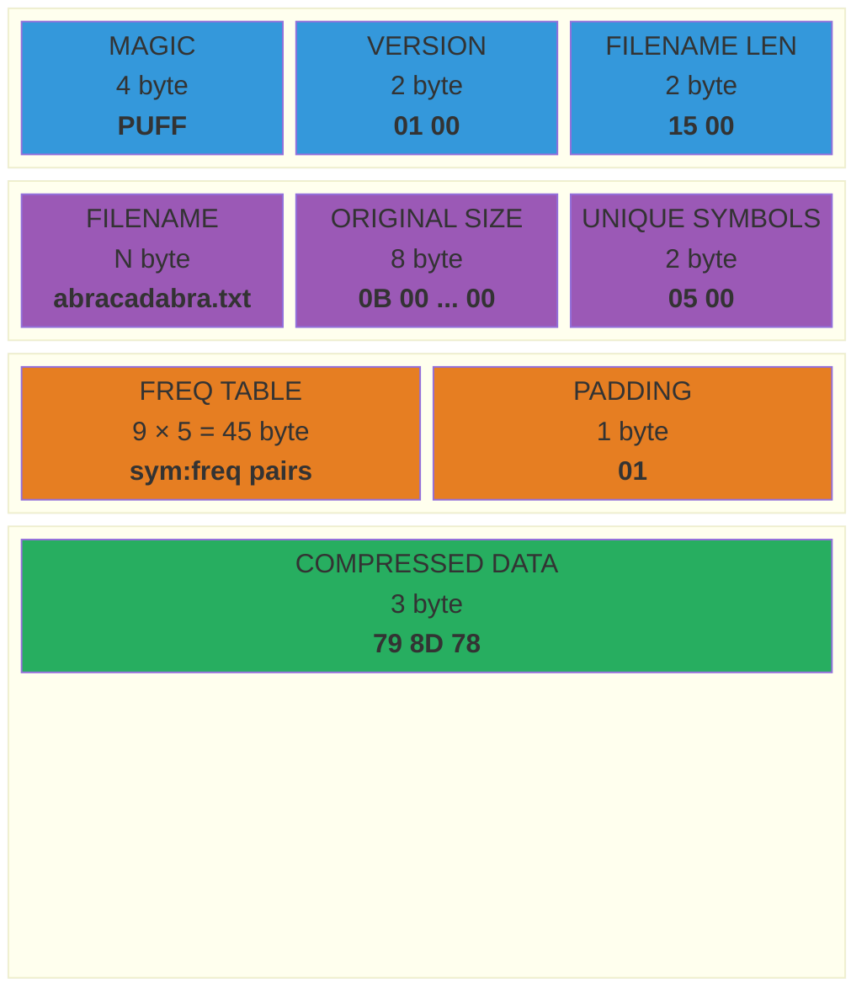

**Contoh `"abracadabra"` — Isi file `.puff` (hex dump):**

```text
Offset  Hex                                        ASCII
──────  ─────────────────────────────────────────  ──────────
0x0000  50 55 46 46                                PUFF          ← Magic
0x0004  01 00                                      ..            ← Version 1.0
0x0006  0F 00                                      ..            ← Filename len = 15
0x0008  61 62 72 61 63 61 64 61 62 72 61 2E 74 78 74  abracadabra.txt
0x0017  0B 00 00 00 00 00 00 00                    ........      ← Original size = 11
0x001F  05 00                                      ..            ← 5 simbol unik
0x0021  61 05 00 00 00 00 00 00 00                 a........     ← 'a' freq=5
0x002A  62 02 00 00 00 00 00 00 00                 b........     ← 'b' freq=2
        ...                                                       ← (r, c, d juga)
0x????  01                                         .             ← 1 bit padding
0x????  79 8D 78                                   y.x           ← Data terkompresi
```

### Konstanta Format

```cpp
inline constexpr char    PUFF_MAGIC[4]      = {'P', 'U', 'F', 'F'};
inline constexpr uint8_t PUFF_VERSION_MAJOR = 0x01;
inline constexpr uint8_t PUFF_VERSION_MINOR = 0x00;
```

**`inline constexpr`** — `constexpr` = nilai diketahui saat kompilasi. `inline` = boleh didefinisikan di header tanpa melanggar ODR (One Definition Rule).

---

### 5.2 Helper Fungsi Serialisasi

```cpp
// Menulis integer dalam format LITTLE-ENDIAN
static void write_u16(std::ostream& out, uint16_t v) {
    out.put(static_cast<char>(v & 0xFF));         // Byte rendah
    out.put(static_cast<char>((v >> 8) & 0xFF));  // Byte tinggi
}
```

**Contoh:** Menulis `uint16_t` nilai `15` (panjang `"abracadabra.txt"`):

```text
v = 15 = 0x000F
Byte 1: 0x000F & 0xFF = 0x0F → tulis 0x0F
Byte 2: (0x000F >> 8) & 0xFF = 0x00 → tulis 0x00
File: [0F 00]  ← little-endian (byte rendah dulu)
```

```cpp
static void write_u64(std::ostream& out, uint64_t v) {
    for (int i = 0; i < 8; ++i)
        out.put(static_cast<char>((v >> (8 * i)) & 0xFF));
}
```

**Contoh:** Menulis `uint64_t` nilai `11` (ukuran `"abracadabra"`):

```text
v = 11 = 0x000000000000000B
i=0: (v >> 0)  & 0xFF = 0x0B  → tulis
i=1: (v >> 8)  & 0xFF = 0x00  → tulis
...
i=7: (v >> 56) & 0xFF = 0x00  → tulis
File: [0B 00 00 00 00 00 00 00]
```

**`static`** — Membatasi visibilitas fungsi hanya di dalam file ini (*internal linkage*).

```cpp
// Membaca integer dari format little-endian
static uint64_t read_u64(std::istream& in) {
    uint64_t v = 0;
    for (int i = 0; i < 8; ++i)
        v |= static_cast<uint64_t>(read_u8(in)) << (8 * i);
    return v;
}
```

**Contoh:** Membaca `[0B 00 00 00 00 00 00 00]`:

```text
i=0: baca 0x0B, geser << 0  = 0x000000000000000B, v |= → v = 0x0B
i=1: baca 0x00, geser << 8  = 0x0000000000000000, v |= → v = 0x0B
...
Hasil: v = 11 ✅
```

---

### 5.3 ArchiveWriter::compress()

Berikut flow kompresi dengan anotasi untuk setiap tahap:

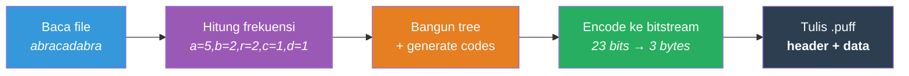

```cpp
void ArchiveWriter::compress(const fs::path& file_path) {
    // 1. VALIDASI
    if (!fs::exists(file_path) || !fs::is_regular_file(file_path)) {
        throw std::runtime_error("Not a regular file: " + file_path.string());
    }

    // 2. BACA seluruh file ke memory
    std::ifstream in(file_path, std::ios::binary);
    std::ostringstream raw_buf;
    raw_buf << in.rdbuf();   // Salin seluruh isi stream ke ostringstream
    std::string raw_data = raw_buf.str();
    // raw_data = "abracadabra" (11 byte)

    // 3. HITUNG frekuensi
    std::istringstream freq_stream(raw_data);
    ByteFrequencyMap frequencies = Encoder::calculate_frequencies(freq_stream);
    // frequencies = {a:5, b:2, r:2, c:1, d:1}

    // 4. BANGUN pohon Huffman + generate kode
    HuffmanTree tree;
    tree.build(frequencies);
    HuffmanCodeMap codes = tree.generate_codes();
    // codes = {a:0, r:10, b:111, c:1100, d:1101}

    // 5. ENCODE
    std::istringstream encode_stream(raw_data);
    std::ostringstream compressed_buf;
    EncodeResult result = Encoder::encode(encode_stream, compressed_buf, codes);
    std::string compressed_data = compressed_buf.str();
    // compressed_data = [0x79, 0x8D, 0x78] (3 byte)
    // result.padding_bits = 1

    // 6. TULIS file .puff
    fs::path output_path = file_path;
    output_path.replace_extension(".puff");
    // "abracadabra.txt" → "abracadabra.puff"

    std::ofstream out(output_path, std::ios::binary);

    write_bytes(out, PUFF_MAGIC, 4);       // "PUFF"
    write_u8(out, PUFF_VERSION_MAJOR);     // 0x01
    write_u8(out, PUFF_VERSION_MINOR);     // 0x00

    std::string filename = file_path.filename().string();
    write_u16(out, static_cast<uint16_t>(filename.size()));  // 15
    write_bytes(out, filename.data(), filename.size());       // "abracadabra.txt"

    write_u64(out, raw_data.size());       // 11

    write_u16(out, static_cast<uint16_t>(frequencies.size()));  // 5
    for (const auto& [sym, freq] : frequencies) {
        write_u8(out, sym);                // 'a'
        write_u64(out, freq);              // 5
    }

    write_u8(out, result.padding_bits);    // 1
    write_bytes(out, compressed_data.data(), compressed_data.size());  // 3 byte
    out.flush();

    // 7. TAMPILKAN hasil
    double ratio = (1.0 - static_cast<double>(compressed_data.size()) /
                          static_cast<double>(raw_data.size())) * 100.0;
    // ratio = (1.0 - 3/11) × 100 = 72.7%

    std::cout << "Compressed: abracadabra.txt -> abracadabra.puff\n"
              << "  Original:   11 bytes\n"
              << "  Compressed: 3 bytes\n"
              << "  Ratio:      72.7% reduction\n";
}
```

**`std::ios::binary`** — Mode biner. Tanpa ini, pada Windows `\n` (0x0A) dikonversi ke `\r\n` (0x0D 0x0A), merusak data.

---

### 5.4 ArchiveReader::extract()

```cpp
void ArchiveReader::extract(const fs::path& archive_path) {
    std::ifstream in(archive_path, std::ios::binary);

    // 1. VALIDASI magic number
    char magic[4]{};
    if (!in.read(magic, 4) || std::memcmp(magic, PUFF_MAGIC, 4) != 0) {
        throw std::runtime_error("Invalid archive format");
    }
    // Baca [50 55 46 46], bandingkan dengan "PUFF" → cocok ✅

    // 2. BACA versi
    uint8_t major = read_u8(in);   // 0x01
    uint8_t minor = read_u8(in);   // 0x00
    (void)minor;  // Suppress "unused variable" warning

    // 3. BACA nama file asli
    uint16_t name_len = read_u16(in);  // 15
    std::string original_filename(name_len, '\0');
    in.read(original_filename.data(), name_len);
    // original_filename = "abracadabra.txt"

    // 4. BACA ukuran asli
    uint64_t original_size = read_u64(in);  // 11

    // 5. BACA tabel frekuensi & REBUILD pohon
    uint16_t unique_symbols = read_u16(in);  // 5
    ByteFrequencyMap frequencies;
    for (uint16_t i = 0; i < unique_symbols; ++i) {
        uint8_t  sym  = read_u8(in);   // 'a', 'b', 'r', 'c', 'd'
        uint64_t freq = read_u64(in);  // 5, 2, 2, 1, 1
        frequencies[sym] = freq;
    }

    read_u8(in);  // padding_bits = 1 (tidak digunakan langsung)

    HuffmanTree tree;
    tree.build(frequencies);
    // Pohon IDENTIK dengan saat compress (karena data frekuensi sama
    // dan build() deterministik)

    // 6. BACA sisa data (bitstream terkompresi)
    std::ostringstream rest;
    rest << in.rdbuf();
    std::string compressed_data = rest.str();
    // compressed_data = [0x79, 0x8D, 0x78]

    // 7. DECODE
    fs::path output_path = archive_path.parent_path() / original_filename;
    std::istringstream compressed_stream(compressed_data);
    std::ofstream out(output_path, std::ios::binary);

    Decoder::decode(compressed_stream, out, tree, original_size);
    // Decode 23 bit → 11 byte → "abracadabra" ✅

    std::cout << "Extracted: abracadabra.puff -> abracadabra.txt\n"
              << "  Size: 11 bytes\n";
}
```

**Kunci Lossless:** `tree.build(frequencies)` menghasilkan pohon **100% identik** karena:
1. Tabel frekuensi disimpan **secara eksak** di header arsip
2. `build()` mengurutkan frekuensi secara **deterministik** sebelum push ke priority queue

---

## 6. Module 3: Statistics

File: `include/statistics.hpp` (deklarasi) + `src/statistics.cpp` (implementasi)

Modul ini menghitung **metrik matematis** dari Information Theory.

---

### 6.1 AnalysisResult

```cpp
struct AnalysisResult {
    std::string filename;
    uint64_t total_symbols  = 0;   // Jumlah total byte
    uint16_t unique_symbols = 0;   // Jumlah simbol unik
    int tree_height         = 0;   // Tinggi pohon Huffman
    int total_nodes         = 0;   // Jumlah node
    double entropy          = 0.0; // Shannon Entropy (bits/symbol)
    double avg_code_length  = 0.0; // Rata-rata panjang kode
    double efficiency       = 0.0; // (entropy / avg_code_length) × 100%

    struct SymbolInfo {
        uint8_t     symbol;
        uint64_t    frequency;
        double      percentage;
        std::string code;          // "010110" dalam bentuk string
    };
    std::vector<SymbolInfo> top_symbols;
};
```

**Contoh `"abracadabra"` — Nilai AnalysisResult:**

```text
filename        = "abracadabra.txt"
total_symbols   = 11
unique_symbols  = 5
tree_height     = 5
total_nodes     = 9
entropy         = 2.04 bits/symbol
avg_code_length = 2.09 bits/symbol
efficiency      = 97.6%
top_symbols     = [{a,5,45.5%,"0"}, {b,2,18.2%,"111"}, {r,2,18.2%,"10"}, ...]
```

---

### 6.2 Statistics::analyze()

```cpp
AnalysisResult Statistics::analyze(const fs::path& file_path) {
    // ... (baca file, hitung frekuensi, bangun tree — sama seperti compress)

    // === SHANNON ENTROPY ===
    // H = -Σ p(x) × log₂(p(x))
    double entropy = 0.0;
    for (const auto& [sym, freq] : frequencies) {
        double p = static_cast<double>(freq) / static_cast<double>(result.total_symbols);
        if (p > 0) entropy -= p * std::log2(p);
    }
    result.entropy = entropy;
```

**Shannon Entropy** (Claude Shannon, 1948) mengukur **rata-rata jumlah informasi minimum** per simbol.

**Formula:** $H = -\sum_{x \in X} p(x) \cdot \log_2 p(x)$

**Perhitungan `"abracadabra"` langkah per langkah:**

```text
p(a) = 5/11 = 0.4545    -p·log₂(p) = -0.4545 × log₂(0.4545) = -0.4545 × (-1.138) = 0.517
p(b) = 2/11 = 0.1818    -p·log₂(p) = -0.1818 × log₂(0.1818) = -0.1818 × (-2.459) = 0.447
p(r) = 2/11 = 0.1818    -p·log₂(p) = -0.1818 × log₂(0.1818) = -0.1818 × (-2.459) = 0.447
p(c) = 1/11 = 0.0909    -p·log₂(p) = -0.0909 × log₂(0.0909) = -0.0909 × (-3.459) = 0.314
p(d) = 1/11 = 0.0909    -p·log₂(p) = -0.0909 × log₂(0.0909) = -0.0909 × (-3.459) = 0.314
                                                                              ─────────
                                                                    H = Σ  = 2.04 bits/symbol
```

**Interpretasi:** Secara teori, setiap karakter dalam `"abracadabra"` membutuhkan **minimal 2.04 bit** untuk di-encode tanpa kehilangan informasi.

```cpp
    // === AVERAGE CODE LENGTH ===
    // L = Σ p(x) × |code(x)|
    double avg_len = 0.0;
    for (const auto& [sym, freq] : frequencies) {
        double p = static_cast<double>(freq) / static_cast<double>(result.total_symbols);
        avg_len += p * static_cast<double>(codes[sym].size());
    }
    result.avg_code_length = avg_len;
```

**Perhitungan `"abracadabra"`:**

```text
L = p(a)×|code(a)| + p(b)×|code(b)| + p(r)×|code(r)| + p(c)×|code(c)| + p(d)×|code(d)|
  = 5/11 × 1       + 2/11 × 3       + 2/11 × 2       + 1/11 × 4       + 1/11 × 4
  = 5/11            + 6/11           + 4/11           + 4/11           + 4/11
  = 23/11
  = 2.09 bits/symbol
```

**Menurut Source Coding Theorem Shannon:** $H \leq L < H + 1$ → $2.04 \leq 2.09 < 3.04$ ✅

```cpp
    // === COMPRESSION EFFICIENCY ===
    result.efficiency = (result.avg_code_length > 0)
        ? (result.entropy / result.avg_code_length) * 100.0
        : 0.0;
```

**Perhitungan `"abracadabra"`:**

```text
η = H/L × 100 = 2.04/2.09 × 100 = 97.6%
```

Artinya kode Huffman kita hanya 2.4% kurang efisien dari batas teori Shannon. Sangat optimal!

---

### 6.3 Statistics::print_report()

```cpp
void Statistics::print_report(const AnalysisResult& result) {
    auto format_symbol = [](uint8_t sym) -> std::string {
        if (sym == ' ') return "' '";
        if (sym == '\n') return "'\\n'";
        if (sym >= 33 && sym < 127) return std::string("'") + static_cast<char>(sym) + "'";
        char buf[8];
        std::snprintf(buf, sizeof(buf), "0x%02X", sym);
        return buf;
    };
```

**Contoh output `"abracadabra"`:**

```text
═══════════════════════════════════════════════════
  Pufferfish — Huffman Analysis
═══════════════════════════════════════════════════
  File:                    abracadabra.txt
  Total Symbols:           11
  Unique Symbols:          5
───────────────────────────────────────────────────
  Tree Height:             5
  Total Nodes:             9
───────────────────────────────────────────────────
  Shannon Entropy:         2.04 bits/symbol
  Average Code Length:     2.09 bits/symbol
  Compression Efficiency:  97.6%
───────────────────────────────────────────────────
  Top Symbols:
    'a'    →  45.5%   Code: 0
    'b'    →  18.2%   Code: 111
    'r'    →  18.2%   Code: 10
    'c'    →   9.1%   Code: 1100
    'd'    →   9.1%   Code: 1101
═══════════════════════════════════════════════════
```

**`std::fixed`** — Notasi desimal tetap (bukan scientific). `4.65` bukan `4.65e+00`.

**`std::setprecision(2)`** — 2 digit di belakang koma. Efek persisten.

**`std::setw(6)`** — Lebar minimum kolom 6 karakter. Efek hanya untuk 1 output berikutnya.

---

## 7. Module 4: CLI Entry Point

File: `src/main.cpp`

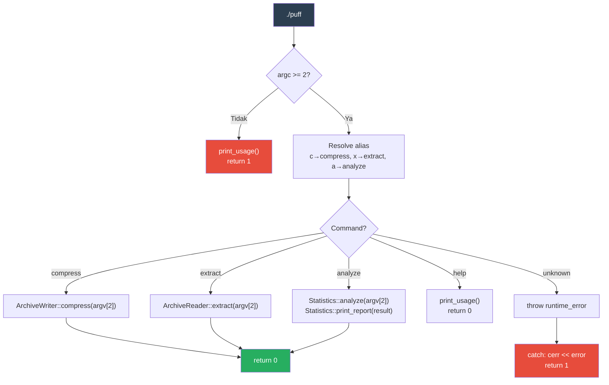

```cpp
int main(int argc, char* argv[]) {
    // argc = jumlah argumen, argv = array of C-strings
    // "./puff compress abracadabra.txt" → argc=3, argv=["./puff","compress","abracadabra.txt"]

    if (argc < 2) {
        pufferfish::print_usage(argv[0]);
        return 1;  // non-zero = error
    }

    std::string cmd = argv[1];
    if (cmd == "c") cmd = "compress";  // Shorthand alias
    if (cmd == "x") cmd = "extract";
    if (cmd == "a") cmd = "analyze";

    try {
        if (cmd == "compress") {
            if (argc < 3) throw std::runtime_error("Requires file argument");
            pufferfish::ArchiveWriter::compress(argv[2]);
            return 0;
        }
        // ... (extract, analyze, help — pola sama)
        throw std::runtime_error("Unknown command: " + cmd);
    } catch (const std::exception& e) {
        std::cerr << "Error: " << e.what() << "\n";
        return 1;
    }
}
```

**`try/catch`** — Semua error dari modul-modul di bawah ditangkap di sini dan ditampilkan ke user via `stderr`.

**`R"(...)"` (di `print_usage`)** — Raw string literal C++11. Multi-baris tanpa escape character.

---

## 8. Konsep Matematika dalam Kode

### Ringkasan Pemetaan Teori → Kode

| Konsep Matematika | Lokasi | Fungsi/Kelas | Contoh "abracadabra" |
| :--- | :--- | :--- | :--- |
| **Binary Tree** | `huffman.hpp` | `HuffmanNode` | 9 node, tinggi 5 |
| **Min-Heap** | `huffman.cpp` | `std::priority_queue` di `build()` | c(1),d(1) diambil pertama |
| **Greedy Algorithm** | `huffman.cpp` | Loop `while (pq.size() > 1)` | 4 iterasi merge |
| **Prefix-Free Code** | `huffman.cpp` | `generate_codes_impl()` | a=0, b=111 (tak ambigu) |
| **Shannon Entropy** | `statistics.cpp` | `analyze()` | H = 2.04 bits/symbol |
| **Lossless Compression** | `archive.cpp` | Round-trip compress→extract | 11 byte → 3 byte → 11 byte |
| **Information Encoding** | `huffman.cpp` | `Encoder::encode()` | 88 bit → 23 bit |
| **DFS Traversal** | `huffman.cpp` | `generate_codes_impl()` | Kiri=0, Kanan=1 |
| **Bitwise Operations** | `huffman.cpp` | `BitWriter`, `BitReader` | `(buffer << 1) \| bit` |
| **Serialisasi Biner** | `archive.cpp` | `write_u16()`, `read_u64()` | Little-endian |

### Visualisasi Ringkasan

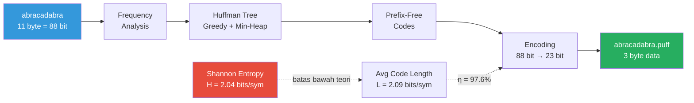

---

## 9. Glossary Sintaks C++ yang Digunakan

| Sintaks | Standar | Penjelasan | Contoh di Proyek |
| :--- | :--- | :--- | :--- |
| `auto` | C++11 | Deduksi tipe otomatis | `auto cmp = [](...){}` |
| `[](auto& a){ ... }` | C++11/14 | Lambda expression | Comparator di `build()` |
| `std::unique_ptr<T>` | C++11 | Smart pointer kepemilikan tunggal | `HuffmanNode::left`, `right` |
| `std::make_unique<T>(...)` | C++14 | Membuat unique_ptr secara aman | `pq.push(make_unique<...>(...))` |
| `std::move(x)` | C++11 | Transfer kepemilikan resource | Move node antar tree |
| `const auto& [k, v]` | C++17 | Structured binding | `for (const auto& [sym, freq] : ...)` |
| `std::optional<T>` | C++17 | Tipe yang bisa kosong | `BitReader::read_bit()` |
| `std::nullopt` | C++17 | Nilai "kosong" untuk optional | Return saat EOF |
| `[[nodiscard]]` | C++17 | Return value harus digunakan | `is_leaf()`, `generate_codes()` |
| `constexpr` | C++11 | Evaluasi saat kompilasi | `PUFF_MAGIC` |
| `noexcept` | C++11 | Tidak melempar exception | `is_leaf()`, `height()` |
| `static_cast<T>(x)` | C++11 | Konversi tipe eksplisit | `char` ↔ `uint8_t` |
| `const_cast<T>(x)` | C++11 | Menghapus qualifier `const` | Move dari `pq.top()` |
| `decltype(expr)` | C++11 | Mendapatkan tipe dari ekspresi | `decltype(cmp)` |
| `R"(...)"` | C++11 | Raw string literal (tanpa escape) | Help text di `main.cpp` |
| `namespace` | C++98 | Pengelompokan nama | `namespace pufferfish { }` |
| `std::filesystem::path` | C++17 | Representasi path cross-platform | Parameter `compress()`, `extract()` |
| `try/catch` | C++98 | Exception handling | `main()` |
| `#ifndef`/`#define`/`#endif` | C89 | Include guard | Setiap `.hpp` |
