# Pufferfish Code Explanation

This document provides a detailed explanation of the entire Pufferfish codebase, covering architecture, workflows (flows), and line-by-line C++ syntax explanations.

All explanations use the string **`"abracadabra"`** as a consistent running example.

---

## Table of Contents

1. [Architecture & Project Structure](#1-architecture--project-structure)
2. [Build System — CMakeLists.txt](#2-build-system--cmakeliststxt)
3. [Overall Workflow (Flow)](#3-overall-workflow-flow)
4. [Module 1: Huffman Core — huffman.hpp & huffman.cpp](#4-module-1-huffman-core)
   - 4.1 [Type Aliases](#41-type-aliases)
   - 4.2 [HuffmanNode (Node Data Structure)](#42-huffmannode)
   - 4.3 [HuffmanTree (Tree Construction)](#43-huffmantree)
   - 4.4 [BitWriter & BitReader (Bit-Level I/O)](#44-bitwriter--bitreader)
   - 4.5 [Encoder & Decoder](#45-encoder--decoder)
5. [Module 2: Archive — archive.hpp & archive.cpp](#5-module-2-archive)
   - 5.1 [.puff Binary Format](#51-puff-binary-format)
   - 5.2 [Serialization Helper Functions](#52-serialization-helper-functions)
   - 5.3 [ArchiveWriter::compress()](#53-archivewritercompress)
   - 5.4 [ArchiveReader::extract()](#54-archivereaderextract)
6. [Module 3: Statistics — statistics.hpp & statistics.cpp](#6-module-3-statistics)
   - 6.1 [AnalysisResult (Result Data Structure)](#61-analysisresult)
   - 6.2 [Statistics::analyze()](#62-statisticsanalyze)
   - 6.3 [Statistics::print_report()](#63-statisticsprint_report)
7. [Module 4: CLI Entry Point — main.cpp](#7-module-4-cli-entry-point)
8. [Mathematical Concepts in the Code](#8-mathematical-concepts-in-the-code)
9. [C++ Syntax Glossary](#9-c-syntax-glossary)

---

## Running Example: `"abracadabra"`

Throughout this document, we use the string **`"abracadabra"`** (11 characters) as our example.

### Frequency Table

| Symbol | Frequency | Percentage |
| :---: | :---: | :---: |
| `a` | 5 | 45.5% |
| `b` | 2 | 18.2% |
| `r` | 2 | 18.2% |
| `c` | 1 | 9.1% |
| `d` | 1 | 9.1% |

**Total:** 11 symbols, **5 unique symbols**

---

## 1. Architecture & Project Structure

```text
pufferfish/
├── CMakeLists.txt              ← Build configuration (CMake)
├── include/                    ← Header files (interface declarations)
│   ├── huffman.hpp             ← Node, Tree, BitIO, Encoder, Decoder declarations
│   ├── archive.hpp             ← ArchiveWriter & ArchiveReader declarations
│   └── statistics.hpp          ← Statistics & AnalysisResult declarations
├── src/                        ← Source files (implementations)
│   ├── huffman.cpp             ← Implementation of everything in huffman.hpp
│   ├── archive.cpp             ← Implementation of compress & extract
│   ├── statistics.cpp          ← Implementation of analyze & print_report
│   └── main.cpp                ← CLI application entry point (main function)
├── docs/                       ← Documentation
└── samples/                    ← Sample files for testing
```

### Design Principles

| Principle | Application |
| :--- | :--- |
| **Separation of Concerns** | Each module has a single responsibility |
| **Header/Source Split** | `.hpp` contains declarations (what), `.cpp` contains implementations (how) |
| **Namespace** | All code resides in `namespace pufferfish` to avoid name conflicts |
| **Include Guard** | Every `.hpp` uses `#ifndef`/`#define`/`#endif` to prevent double inclusion |

### Inter-Module Dependency Diagram

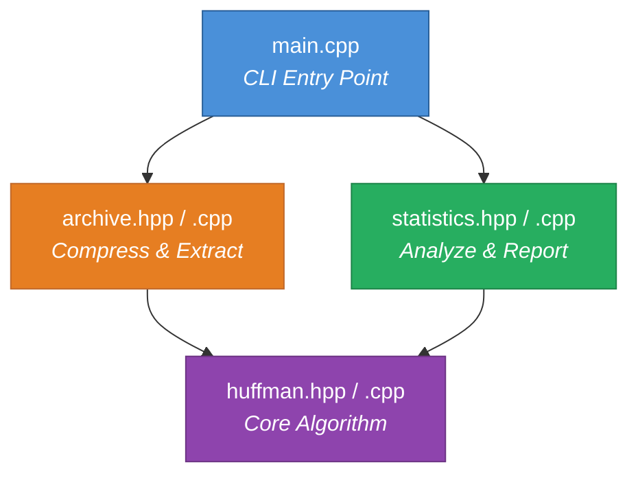

`huffman.hpp` is the **foundation** — all other modules depend on it, but it depends on nothing else.

---

## 2. Build System — CMakeLists.txt

```cmake
cmake_minimum_required(VERSION 3.16)
project(pufferfish VERSION 1.0.0 LANGUAGES CXX)

set(CMAKE_CXX_STANDARD 20)
set(CMAKE_CXX_STANDARD_REQUIRED ON)

include_directories(include)

add_executable(puff
    src/huffman.cpp
    src/archive.cpp
    src/statistics.cpp
    src/main.cpp
)
```

### Line-by-Line Explanation

| Line | Explanation |
| :--- | :--- |
| `cmake_minimum_required(VERSION 3.16)` | Sets the minimum required CMake version. Version 3.16 supports C++20. |
| `project(pufferfish VERSION 1.0.0 LANGUAGES CXX)` | Defines the project name, semantic version, and language used (C++). |
| `set(CMAKE_CXX_STANDARD 20)` | Uses the C++20 standard. Required for features like `std::optional`, structured bindings, and `[[nodiscard]]`. |
| `set(CMAKE_CXX_STANDARD_REQUIRED ON)` | If the compiler doesn't support C++20, the build will **fail** (no fallback to older versions). |
| `include_directories(include)` | Adds the `include/` folder to the search path, so `#include "huffman.hpp"` can be found by the compiler. |
| `add_executable(puff ...)` | Defines an executable target named `puff` from 4 `.cpp` files. CMake will compile each `.cpp` into an *object file* then *link* them into one executable. |

---

## 3. Overall Workflow (Flow)

### 3.1 Compress Flow

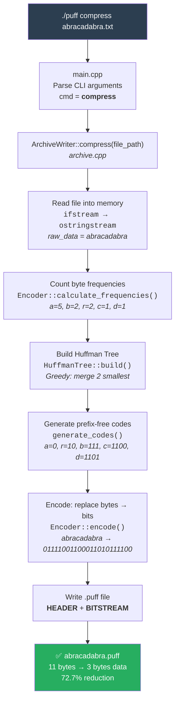

### 3.2 Extract Flow

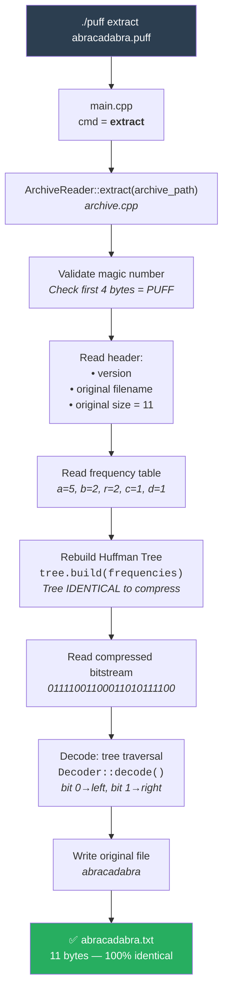

### 3.3 Analyze Flow

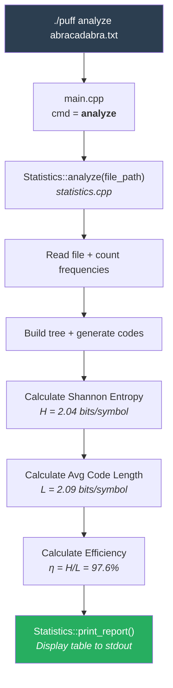

---

## 4. Module 1: Huffman Core

File: `include/huffman.hpp` (declarations) + `src/huffman.cpp` (implementation)

This module contains the **entire core Huffman Coding algorithm**. It is the heart of the project.

---

### 4.1 Type Aliases

```cpp
using ByteFrequencyMap = std::unordered_map<uint8_t, uint64_t>;
using HuffmanCodeMap   = std::unordered_map<uint8_t, std::vector<bool>>;
```

| Alias | Underlying Type | Purpose |
| :--- | :--- | :--- |
| `ByteFrequencyMap` | `unordered_map<uint8_t, uint64_t>` | Maps each byte (0–255) to how many times it appears. |
| `HuffmanCodeMap` | `unordered_map<uint8_t, vector<bool>>` | Maps each byte to its Huffman code (a sequence of bits). |

**`"abracadabra"` example:**

```text
ByteFrequencyMap:
  'a' (97)  → 5
  'b' (98)  → 2
  'r' (114) → 2
  'c' (99)  → 1
  'd' (100) → 1

HuffmanCodeMap:
  'a' (97)  → [0]              = "0"
  'r' (114) → [1,0]            = "10"
  'b' (98)  → [1,1,1]          = "111"
  'c' (99)  → [1,1,0,0]        = "1100"
  'd' (100) → [1,1,0,1]        = "1101"
```

**Why `uint8_t`?** Because one byte has 256 possible values (0–255). The `uint8_t` type represents this precisely.

**Why `vector<bool>`?** Because Huffman codes have variable length (not multiples of 8). `vector<bool>` lets us store bit sequences of any length.

**Why `unordered_map`?** Because it provides $O(1)$ average lookup, compared to `std::map`'s $O(\log n)$.

---

### 4.2 HuffmanNode

#### Declaration (huffman.hpp)

```cpp
struct HuffmanNode {
    uint8_t  symbol    = 0;
    uint64_t frequency = 0;
    std::unique_ptr<HuffmanNode> left;
    std::unique_ptr<HuffmanNode> right;

    HuffmanNode(uint8_t sym, uint64_t freq);
    HuffmanNode(std::unique_ptr<HuffmanNode> l, std::unique_ptr<HuffmanNode> r);
    [[nodiscard]] bool is_leaf() const noexcept;
};
```

#### Field Explanation

| Field | Type | Explanation |
| :--- | :--- | :--- |
| `symbol` | `uint8_t` | The byte this node represents. Only meaningful for **leaf nodes**. Internal nodes always have `symbol = 0`. |
| `frequency` | `uint64_t` | Occurrence count. For internal nodes = **sum of both children's frequencies**. |
| `left` | `unique_ptr<HuffmanNode>` | Left child (represents bit `0`). `nullptr` if leaf. |
| `right` | `unique_ptr<HuffmanNode>` | Right child (represents bit `1`). `nullptr` if leaf. |

**`"abracadabra"` example — Node types:**

```text
LEAF NODE:       HuffmanNode('a', 5)     → symbol=97, freq=5, left=null, right=null
INTERNAL NODE:   HuffmanNode(left, right) → symbol=0,  freq=left.freq+right.freq
```

#### Implementation (huffman.cpp)

```cpp
// Constructor for LEAF NODE
HuffmanNode::HuffmanNode(uint8_t sym, uint64_t freq)
    : symbol(sym), frequency(freq) {}
```

**Syntax `: symbol(sym), frequency(freq)`** — This is a *member initializer list*. Instead of assigning in the constructor body, we directly initialize members at construction time. This is more efficient because it avoids default-construction followed by assignment.

```cpp
// Constructor for INTERNAL NODE (branch node)
HuffmanNode::HuffmanNode(std::unique_ptr<HuffmanNode> l, std::unique_ptr<HuffmanNode> r)
    : symbol(0), frequency(l->frequency + r->frequency),
      left(std::move(l)), right(std::move(r)) {}
```

**`std::move(l)`** — `unique_ptr` cannot be copied (single ownership). `std::move` transfers ownership from the parameter to the member. After the move, `l` becomes `nullptr`.

**`l->frequency + r->frequency`** — Internal node frequency = sum of both children. This is a fundamental property of the Huffman Tree.

**Example:** When merging `c(1)` and `d(1)` → internal node with `frequency = 1 + 1 = 2`.

```cpp
bool HuffmanNode::is_leaf() const noexcept {
    return !left && !right;
}
```

**`const noexcept`** — `const` = doesn't modify object state. `noexcept` = won't throw exceptions, allowing the compiler to optimize more aggressively.

**`[[nodiscard]]`** (in declaration) — C++17 attribute that forces callers to use the return value.

---

### 4.3 HuffmanTree

#### `build()` — Tree Construction (Greedy Algorithm + Priority Queue)

This is the **most important function** in the entire project. It implements a **greedy algorithm** using a **min-heap (priority queue)**.

##### Step-by-Step Example with `"abracadabra"`

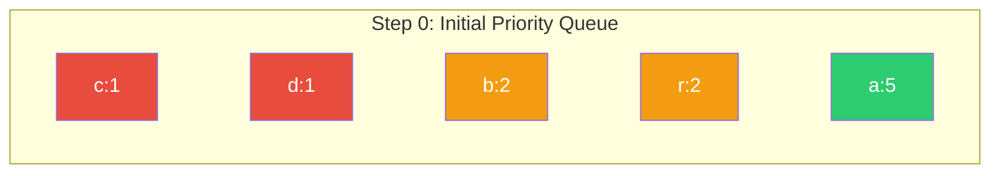

**Step 1:** Extract 2 smallest: `c(1)` and `d(1)` → merge into `[cd](2)`

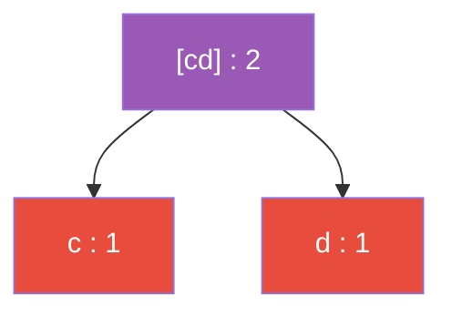

```text
Queue: [cd](2,sym=0), b(2,sym=98), r(2,sym=114), a(5,sym=97)
```

**Step 2:** Extract 2 smallest: `[cd](2)` and `b(2)` → merge into `[cd-b](4)`

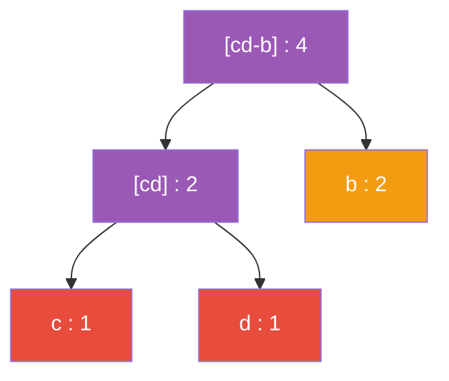

```text
Queue: r(2), [cd-b](4), a(5)
```

**Step 3:** Extract 2 smallest: `r(2)` and `[cd-b](4)` → merge into `[r-cdb](6)`

```text
Queue: a(5), [r-cdb](6)
```

**Step 4 (Final):** Extract 2 smallest: `a(5)` and `[r-cdb](6)` → merge into **ROOT** `(11)`

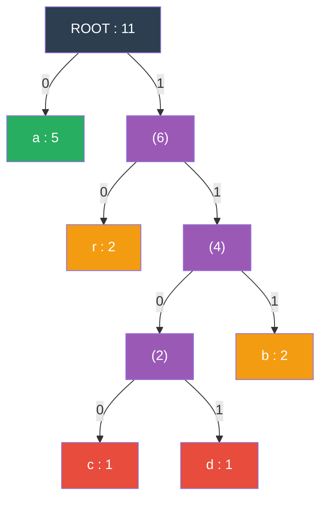

**Resulting Huffman Codes (read path from root to leaf):**

| Symbol | Path | Code | Length |
| :---: | :--- | :---: | :---: |
| `a` | left | `0` | 1 bit |
| `r` | right → left | `10` | 2 bits |
| `b` | right → right → right | `111` | 3 bits |
| `c` | right → right → left → left | `1100` | 4 bits |
| `d` | right → right → left → right | `1101` | 4 bits |

**Notice:** The most frequent symbol (`a`, 45.5%) gets the shortest code (1 bit), while the least frequent symbols (`c`, `d`, 9.1%) get the longest codes (4 bits). **This is the essence of Huffman Coding.**

##### `build()` Code — Line-by-Line Explanation

```cpp
void HuffmanTree::build(const ByteFrequencyMap& frequencies) {
    // Base case: if no symbols, tree is empty
    if (frequencies.empty()) {
        root_ = nullptr;
        return;
    }
```

```cpp
    // COMPARATOR for priority queue (min-heap)
    // C++ std::priority_queue is a MAX-heap by default,
    // so we REVERSE the comparison (a > b) to make it a MIN-heap
    auto cmp = [](const std::unique_ptr<HuffmanNode>& a,
                  const std::unique_ptr<HuffmanNode>& b) {
        // Primary: LOWER frequency = HIGHER priority
        if (a->frequency != b->frequency) return a->frequency > b->frequency;
        // Tie-breaker: if frequencies are equal, LOWER symbol goes first
        return a->symbol > b->symbol;
    };
```

**Lambda `[](...) { ... }`** — Anonymous function defined inline. `[]` = empty *capture list* (doesn't capture outer variables).

**Why `a > b` instead of `a < b`?** — `std::priority_queue` defaults to a **max-heap** (largest on top). To get a **min-heap** (smallest on top), we reverse the comparison.

**Tie-breaking example with `"abracadabra"`:**
- `b(freq=2, sym=98)` vs `r(freq=2, sym=114)` → same frequency → sym 98 < 114 → `b` has higher priority than `r`.

```cpp
    // Priority queue declaration with custom comparator
    std::priority_queue<
        std::unique_ptr<HuffmanNode>,              // Element type
        std::vector<std::unique_ptr<HuffmanNode>>,  // Internal container
        decltype(cmp)                               // Comparator type
    > pq(cmp);
```

**`decltype(cmp)`** — C++11 keyword that yields the type of the expression `cmp`. Since lambdas have unique types that can't be written manually, we use `decltype` to obtain it.

```cpp
    // DETERMINISM FIX: Copy to vector and sort by symbol
    // BEFORE pushing to priority queue.
    //
    // WHY? unordered_map doesn't guarantee iteration order.
    // During compress: map is filled from file scan (first-occurrence order).
    // During extract: map is filled from archive header (different order).
    // Different push order → different tie-breaking for internal nodes → DIFFERENT tree
    // → decode fails!
    std::vector<std::pair<uint8_t, uint64_t>> sorted_freq(
        frequencies.begin(), frequencies.end()
    );
    std::sort(sorted_freq.begin(), sorted_freq.end(),
              [](const auto& a, const auto& b) { return a.first < b.first; });
```

**`"abracadabra"` example:**

```text
BEFORE sort (from unordered_map, RANDOM order):
  [('r',2), ('a',5), ('d',1), ('b',2), ('c',1)]   ← can differ each time!

AFTER sort (by symbol ascending):
  [('a',5), ('b',2), ('c',1), ('d',1), ('r',2)]    ← ALWAYS this order
```

```cpp
    // Push all leaf nodes to priority queue (in deterministic order)
    for (const auto& [sym, freq] : sorted_freq) {
        pq.push(std::make_unique<HuffmanNode>(sym, freq));
    }
```

**`const auto& [sym, freq]`** — *Structured binding* (C++17). Automatically decomposes a `std::pair` into two variables.

**`std::make_unique<HuffmanNode>(sym, freq)`** — Creates a `unique_ptr<HuffmanNode>` on the heap. Safer and more efficient than `new`.

```cpp
    // === CORE GREEDY ALGORITHM ===
    // Repeat until one node remains (root):
    //   1. Extract 2 nodes with lowest frequency
    //   2. Merge into one new internal node
    //   3. Insert back into priority queue
    while (pq.size() > 1) {
        auto left  = std::move(const_cast<std::unique_ptr<HuffmanNode>&>(pq.top()));
        pq.pop();
        auto right = std::move(const_cast<std::unique_ptr<HuffmanNode>&>(pq.top()));
        pq.pop();
        pq.push(std::make_unique<HuffmanNode>(std::move(left), std::move(right)));
    }
```

**Why `const_cast`?** — `pq.top()` returns `const&`, but we need `std::move`. `const_cast` removes `const`. This is safe because we immediately `pop()` afterwards.

**Greedy Choice:** Every iteration **always** extracts the 2 smallest nodes. This is mathematically proven to produce **optimal** codes.

**`"abracadabra"` trace (summary):**

```text
Initial queue:  c(1) d(1) b(2) r(2) a(5)       ← 5 nodes
Iteration 1:    [cd](2) b(2) r(2) a(5)          ← 4 nodes, merge c+d
Iteration 2:    r(2) [cd-b](4) a(5)             ← 3 nodes, merge [cd]+b
Iteration 3:    a(5) [r-cdb](6)                 ← 2 nodes, merge r+[cd-b]
Iteration 4:    ROOT(11)                         ← 1 node, merge a+[r-cdb]
```

```cpp
    // The last remaining node is the ROOT
    root_ = std::move(const_cast<std::unique_ptr<HuffmanNode>&>(pq.top()));
    pq.pop();
}
```

---

#### `generate_codes()` — Generating Prefix-Free Codes

```cpp
HuffmanCodeMap HuffmanTree::generate_codes() const {
    HuffmanCodeMap codes;
    if (!root_) return codes;

    std::vector<bool> current_code;

    // Edge case: tree has only 1 leaf (1 unique symbol, e.g. "aaaa")
    if (root_->is_leaf()) {
        codes[root_->symbol] = {false};  // false = bit 0
        return codes;
    }

    generate_codes_impl(root_.get(), current_code, codes);
    return codes;
}
```

**`root_.get()`** — `unique_ptr::get()` returns a raw pointer without releasing ownership. The recursive function only needs to *observe*, not *own* the node.

```cpp
// Recursive DFS (Depth-First Search) function for tree traversal
void HuffmanTree::generate_codes_impl(
    const HuffmanNode* node,
    std::vector<bool>& current_code,
    HuffmanCodeMap& codes
) {
    if (!node) return;

    // If we've reached a leaf node, save the current code
    if (node->is_leaf()) {
        codes[node->symbol] = current_code;
        return;
    }

    // Traverse LEFT = append bit 0
    current_code.push_back(false);
    generate_codes_impl(node->left.get(), current_code, codes);
    current_code.pop_back();  // Backtrack

    // Traverse RIGHT = append bit 1
    current_code.push_back(true);
    generate_codes_impl(node->right.get(), current_code, codes);
    current_code.pop_back();  // Backtrack
}
```

**Backtracking technique:** `push_back` adds a bit before entering a subtree, `pop_back` removes it after returning. `current_code` always contains the path from root to the current node.

**DFS trace on the `"abracadabra"` tree:**

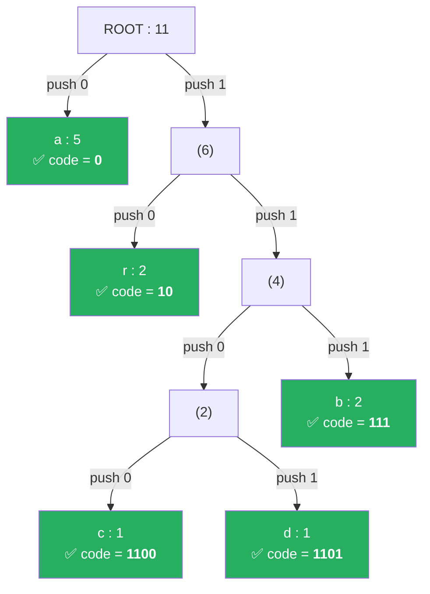

```text
DFS traversal (depth-first, left-first):

1. ROOT → left → LEAF 'a'
   current_code = [0]
   codes['a'] = [0]  ← save
   pop_back → current_code = []

2. ROOT → right → (6) → left → LEAF 'r'
   current_code = [1, 0]
   codes['r'] = [1,0]  ← save
   pop_back → current_code = [1]

3. ROOT → right → (6) → right → (4) → left → (2) → left → LEAF 'c'
   current_code = [1, 1, 0, 0]
   codes['c'] = [1,1,0,0]  ← save
   pop_back → current_code = [1, 1, 0]

4. ROOT → right → (6) → right → (4) → left → (2) → right → LEAF 'd'
   current_code = [1, 1, 0, 1]
   codes['d'] = [1,1,0,1]  ← save
   pop_back → current_code = [1, 1, 0]
   pop_back → current_code = [1, 1]

5. ROOT → right → (6) → right → (4) → right → LEAF 'b'
   current_code = [1, 1, 1]
   codes['b'] = [1,1,1]  ← save
```

**Prefix-Free Property:** Codes are only assigned to **leaf nodes**. No leaf is an ancestor of another leaf → no code is a prefix of another code → **unambiguous decoding**.

---

#### Tree Utility Functions

```cpp
int HuffmanTree::height_impl(const HuffmanNode* node) noexcept {
    if (!node) return 0;
    if (node->is_leaf()) return 1;
    return 1 + std::max(height_impl(node->left.get()),
                        height_impl(node->right.get()));
}

int HuffmanTree::node_count_impl(const HuffmanNode* node) noexcept {
    if (!node) return 0;
    return 1 + node_count_impl(node->left.get())
             + node_count_impl(node->right.get());
}
```

**`"abracadabra"` example:**
- **Height** = 5 (longest path: ROOT → (6) → (4) → (2) → c/d)
- **Node count** = 9 (5 leaf + 4 internal)

---

### 4.4 BitWriter & BitReader

Huffman codes have variable lengths (e.g. 1 bit, 3 bits, 4 bits). Files can only store **bytes** (8 bits). These classes bridge that gap.

#### BitWriter — Writing Bits One at a Time to an Output Stream

```cpp
class BitWriter {
private:
    std::ostream& out_;          // Reference to output stream
    uint8_t  buffer_     = 0;    // 8-bit buffer being filled
    int      bit_count_  = 0;    // How many bits are currently in the buffer
    uint64_t bytes_written_ = 0; // Total byte counter
};
```

```cpp
void BitWriter::write_bit(bool bit) {
    // Shift buffer left 1 position, insert new bit at LSB
    buffer_ = static_cast<uint8_t>((buffer_ << 1) | (bit ? 1 : 0));
    ++bit_count_;

    // If buffer is full (8 bits), write to stream
    if (bit_count_ == 8) {
        out_.put(static_cast<char>(buffer_));
        ++bytes_written_;
        buffer_    = 0;
        bit_count_ = 0;
    }
}
```

**`"abracadabra"` example — Encoding process:**

```text
Input:  a      b      r      a      c         a      d         a      b      r      a
Code:   0      111    10     0      1100      0      1101      0      111    10     0
```

**Byte-by-byte buffer visualization:**

```text
Full bitstream: 0 1 1 1 1 0 0 1 | 1 0 0 0 1 1 0 1 | 0 1 1 1 1 0 0 [pad]
                ─────────────────  ─────────────────  ─────────────────────
                    Byte 1             Byte 2             Byte 3
                    = 0x79             = 0x8D             = 0x78 (1 bit pad)

Step-by-step buffer for Byte 1:
  bit 0: buffer = 00000000  →  (0 << 1) | 0 = 00000000  (bit_count=1)
  bit 1: buffer = 00000000  →  (0 << 1) | 1 = 00000001  (bit_count=2)
  bit 1: buffer = 00000001  →  (1 << 1) | 1 = 00000011  (bit_count=3)
  bit 1: buffer = 00000011  →  (3 << 1) | 1 = 00000111  (bit_count=4)
  bit 1: buffer = 00000111  →  (7 << 1) | 1 = 00001111  (bit_count=5)
  bit 0: buffer = 00001111  →  (15<< 1) | 0 = 00011110  (bit_count=6)
  bit 0: buffer = 00011110  →  (30<< 1) | 0 = 00111100  (bit_count=7)
  bit 1: buffer = 00111100  →  (60<< 1) | 1 = 01111001  (bit_count=8) → WRITE!
  Byte 1 = 0x79 = 01111001
```

```cpp
uint8_t BitWriter::flush() {
    if (bit_count_ == 0) return 0;  // No remaining bits
    uint8_t padding = static_cast<uint8_t>(8 - bit_count_);
    buffer_ = static_cast<uint8_t>(buffer_ << padding);
    out_.put(static_cast<char>(buffer_));
    ++bytes_written_;
    buffer_    = 0;
    bit_count_ = 0;
    return padding;
}
```

**`"abracadabra"` example — Flushing the last byte:**

```text
After writing 23 bits, buffer contains 7 bits: 0111100
bit_count = 7, padding = 8 - 7 = 1

Shift left 1 position: 0111100 → 01111000 = 0x78
Write 0x78 to stream.

Result: 3 compressed bytes: [0x79, 0x8D, 0x78]
padding_bits = 1  (stored in .puff header so decoder knows the last bit isn't data)
```

#### BitReader — Reading Bits One at a Time from an Input Stream

```cpp
std::optional<bool> BitReader::read_bit() {
    if (bits_remaining_ == 0) {
        char ch;
        if (!in_.get(ch)) return std::nullopt;  // EOF
        buffer_         = static_cast<uint8_t>(ch);
        bits_remaining_ = 8;
    }
    --bits_remaining_;
    return (buffer_ >> bits_remaining_) & 1;
}
```

**`std::optional<bool>`** — C++17 type that can hold a `bool` or *nothing* (`std::nullopt`). Elegantly signals EOF.

**Example reading Byte 1 (0x79 = 01111001):**

```text
buffer = 01111001, bits_remaining = 8

read_bit() → bits_remaining=7, (01111001 >> 7) & 1 = 0   ← first bit
read_bit() → bits_remaining=6, (01111001 >> 6) & 1 = 1
read_bit() → bits_remaining=5, (01111001 >> 5) & 1 = 1
read_bit() → bits_remaining=4, (01111001 >> 4) & 1 = 1
read_bit() → bits_remaining=3, (01111001 >> 3) & 1 = 1
read_bit() → bits_remaining=2, (01111001 >> 2) & 1 = 0
read_bit() → bits_remaining=1, (01111001 >> 1) & 1 = 0
read_bit() → bits_remaining=0, (01111001 >> 0) & 1 = 1

Result: 0,1,1,1,1,0,0,1 ← exactly matches what was written!
```

---

### 4.5 Encoder & Decoder

#### Encoder::calculate_frequencies()

```cpp
ByteFrequencyMap Encoder::calculate_frequencies(std::istream& input) {
    ByteFrequencyMap freq;
    char ch;
    while (input.get(ch)) {
        ++freq[static_cast<uint8_t>(ch)];
    }
    return freq;
}
```

**`"abracadabra"` example:**

```text
Read 'a' → freq = {a:1}
Read 'b' → freq = {a:1, b:1}
Read 'r' → freq = {a:1, b:1, r:1}
Read 'a' → freq = {a:2, b:1, r:1}
Read 'c' → freq = {a:2, b:1, r:1, c:1}
Read 'a' → freq = {a:3, b:1, r:1, c:1}
Read 'd' → freq = {a:3, b:1, r:1, c:1, d:1}
Read 'a' → freq = {a:4, b:1, r:1, c:1, d:1}
Read 'b' → freq = {a:4, b:2, r:1, c:1, d:1}
Read 'r' → freq = {a:4, b:2, r:2, c:1, d:1}
Read 'a' → freq = {a:5, b:2, r:2, c:1, d:1}  ← FINAL RESULT
```

**`++freq[static_cast<uint8_t>(ch)]`** — `operator[]` creates a new entry (value=0) if the key doesn't exist, then `++` increments by 1. Standard C++ idiom for frequency counting.

#### Encoder::encode()

```cpp
EncodeResult Encoder::encode(
    std::istream& input, std::ostream& output,
    const HuffmanCodeMap& codes
) {
    BitWriter writer(output);
    char ch;
    while (input.get(ch)) {
        auto it = codes.find(static_cast<uint8_t>(ch));
        if (it != codes.end()) {
            writer.write_bits(it->second);
        }
    }
    uint8_t padding = writer.flush();
    return {writer.bytes_written(), padding};
}
```

**`"abracadabra"` example:**

```text
Read 'a' → lookup codes['a'] = [0]        → write bits: 0
Read 'b' → lookup codes['b'] = [1,1,1]    → write bits: 1,1,1
Read 'r' → lookup codes['r'] = [1,0]      → write bits: 1,0
Read 'a' → lookup codes['a'] = [0]        → write bits: 0
Read 'c' → lookup codes['c'] = [1,1,0,0]  → write bits: 1,1,0,0
Read 'a' → lookup codes['a'] = [0]        → write bits: 0
Read 'd' → lookup codes['d'] = [1,1,0,1]  → write bits: 1,1,0,1
Read 'a' → lookup codes['a'] = [0]        → write bits: 0
Read 'b' → lookup codes['b'] = [1,1,1]    → write bits: 1,1,1
Read 'r' → lookup codes['r'] = [1,0]      → write bits: 1,0
Read 'a' → lookup codes['a'] = [0]        → write bits: 0

Total: 23 bits → 3 bytes + 1 bit padding
```

**`return {writer.bytes_written(), padding}`** — *Aggregate initialization* (C++11). Creates an `EncodeResult` directly without naming the struct.

#### Decoder::decode()

```cpp
void Decoder::decode(
    std::istream& input, std::ostream& output,
    const HuffmanTree& tree, uint64_t original_size
) {
    if (original_size == 0 || tree.empty()) return;

    const HuffmanNode* root = tree.get_root();
    BitReader reader(input);

    // Edge case: only one unique symbol (e.g. "aaaa")
    if (root->is_leaf()) {
        for (uint64_t i = 0; i < original_size; ++i) {
            output.put(static_cast<char>(root->symbol));
            reader.read_bit();
        }
        return;
    }

    uint64_t decoded = 0;
    const HuffmanNode* current = root;

    while (decoded < original_size) {
        auto bit = reader.read_bit();
        if (!bit.has_value()) {
            throw std::runtime_error("Unexpected end of bitstream");
        }
        // bit=0 → left, bit=1 → right
        current = bit.value() ? current->right.get() : current->left.get();
        if (!current) {
            throw std::runtime_error("Invalid Huffman tree path");
        }
        if (current->is_leaf()) {
            output.put(static_cast<char>(current->symbol));
            ++decoded;
            current = root;  // Reset for the next symbol
        }
    }
}
```

**`"abracadabra"` example — Decoding trace:**

```text
Bitstream: 0 1 1 1 1 0 0 1 1 0 0 0 1 1 0 1 0 1 1 1 1 0 0

Decode symbol #1:
  bit=0 → ROOT left → LEAF 'a' ✅ → output 'a', reset to ROOT

Decode symbol #2:
  bit=1 → ROOT right → (6)
  bit=1 → (6) right → (4)
  bit=1 → (4) right → LEAF 'b' ✅ → output 'b', reset to ROOT

Decode symbol #3:
  bit=1 → ROOT right → (6)
  bit=0 → (6) left → LEAF 'r' ✅ → output 'r', reset to ROOT

Decode symbol #4:
  bit=0 → ROOT left → LEAF 'a' ✅ → output 'a', reset to ROOT

Decode symbol #5:
  bit=1 → ROOT right → (6)
  bit=1 → (6) right → (4)
  bit=0 → (4) left → (2)
  bit=0 → (2) left → LEAF 'c' ✅ → output 'c', reset to ROOT

Decode symbol #6:
  bit=0 → ROOT left → LEAF 'a' ✅ → output 'a'

Decode symbol #7:
  bit=1 → ROOT right → (6)
  bit=1 → (6) right → (4)
  bit=0 → (4) left → (2)
  bit=1 → (2) right → LEAF 'd' ✅ → output 'd'

  ... (continues until decoded = 11 = original_size)

Result: a b r a c a d a b r a = "abracadabra" ← IDENTICAL! ✅
```

**`original_size`** — Critical for knowing when to stop. Without it, the decoder would read padding bits at the end and produce garbage bytes.

---

## 5. Module 2: Archive

File: `include/archive.hpp` (declarations) + `src/archive.cpp` (implementation)

This module handles **serialization** (writing structured data to a binary file) and **deserialization** (reading it back).

---

### 5.1 .puff Binary Format

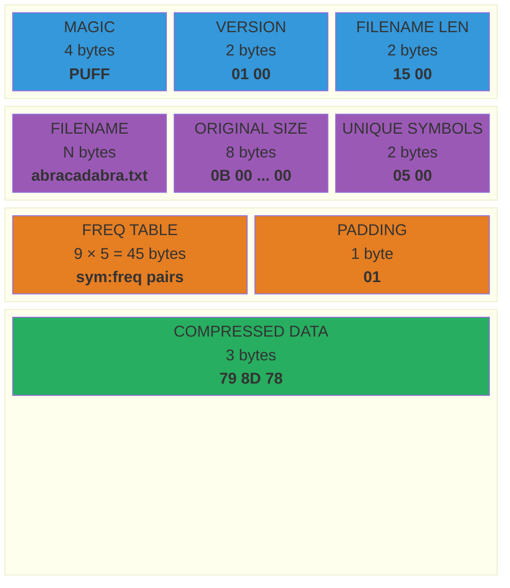

**`"abracadabra"` example — .puff file contents (hex dump):**

```text
Offset  Hex                                        ASCII
──────  ─────────────────────────────────────────  ──────────
0x0000  50 55 46 46                                PUFF          ← Magic
0x0004  01 00                                      ..            ← Version 1.0
0x0006  0F 00                                      ..            ← Filename len = 15
0x0008  61 62 72 61 63 61 64 61 62 72 61 2E 74 78 74  abracadabra.txt
0x0017  0B 00 00 00 00 00 00 00                    ........      ← Original size = 11
0x001F  05 00                                      ..            ← 5 unique symbols
0x0021  61 05 00 00 00 00 00 00 00                 a........     ← 'a' freq=5
0x002A  62 02 00 00 00 00 00 00 00                 b........     ← 'b' freq=2
        ...                                                       ← (r, c, d too)
0x????  01                                         .             ← 1 bit padding
0x????  79 8D 78                                   y.x           ← Compressed data
```

### Format Constants

```cpp
inline constexpr char    PUFF_MAGIC[4]      = {'P', 'U', 'F', 'F'};
inline constexpr uint8_t PUFF_VERSION_MAJOR = 0x01;
inline constexpr uint8_t PUFF_VERSION_MINOR = 0x00;
```

**`inline constexpr`** — `constexpr` = value known at compile time. `inline` = can be defined in a header without violating ODR (One Definition Rule).

---

### 5.2 Serialization Helper Functions

```cpp
// Writes integers in LITTLE-ENDIAN format
static void write_u16(std::ostream& out, uint16_t v) {
    out.put(static_cast<char>(v & 0xFF));         // Low byte
    out.put(static_cast<char>((v >> 8) & 0xFF));  // High byte
}
```

**Example:** Writing `uint16_t` value `15` (length of `"abracadabra.txt"`):

```text
v = 15 = 0x000F
Byte 1: 0x000F & 0xFF = 0x0F → write 0x0F
Byte 2: (0x000F >> 8) & 0xFF = 0x00 → write 0x00
File: [0F 00]  ← little-endian (low byte first)
```

```cpp
static void write_u64(std::ostream& out, uint64_t v) {
    for (int i = 0; i < 8; ++i)
        out.put(static_cast<char>((v >> (8 * i)) & 0xFF));
}
```

**Example:** Writing `uint64_t` value `11` (size of `"abracadabra"`):

```text
v = 11 = 0x000000000000000B
i=0: (v >> 0)  & 0xFF = 0x0B  → write
i=1: (v >> 8)  & 0xFF = 0x00  → write
...
i=7: (v >> 56) & 0xFF = 0x00  → write
File: [0B 00 00 00 00 00 00 00]
```

**`static`** — Restricts function visibility to this file only (*internal linkage*).

```cpp
// Reads integers from little-endian format
static uint64_t read_u64(std::istream& in) {
    uint64_t v = 0;
    for (int i = 0; i < 8; ++i)
        v |= static_cast<uint64_t>(read_u8(in)) << (8 * i);
    return v;
}
```

**Example:** Reading `[0B 00 00 00 00 00 00 00]`:

```text
i=0: read 0x0B, shift << 0  = 0x000000000000000B, v |= → v = 0x0B
i=1: read 0x00, shift << 8  = 0x0000000000000000, v |= → v = 0x0B
...
Result: v = 11 ✅
```

---

### 5.3 ArchiveWriter::compress()

Compression flow with annotations for each stage:


```cpp
void ArchiveWriter::compress(const fs::path& file_path) {
    // 1. VALIDATE
    if (!fs::exists(file_path) || !fs::is_regular_file(file_path)) {
        throw std::runtime_error("Not a regular file: " + file_path.string());
    }

    // 2. READ entire file into memory
    std::ifstream in(file_path, std::ios::binary);
    std::ostringstream raw_buf;
    raw_buf << in.rdbuf();   // Copy entire stream contents to ostringstream
    std::string raw_data = raw_buf.str();
    // raw_data = "abracadabra" (11 bytes)

    // 3. COUNT frequencies
    std::istringstream freq_stream(raw_data);
    ByteFrequencyMap frequencies = Encoder::calculate_frequencies(freq_stream);
    // frequencies = {a:5, b:2, r:2, c:1, d:1}

    // 4. BUILD Huffman tree + generate codes
    HuffmanTree tree;
    tree.build(frequencies);
    HuffmanCodeMap codes = tree.generate_codes();
    // codes = {a:0, r:10, b:111, c:1100, d:1101}

    // 5. ENCODE
    std::istringstream encode_stream(raw_data);
    std::ostringstream compressed_buf;
    EncodeResult result = Encoder::encode(encode_stream, compressed_buf, codes);
    std::string compressed_data = compressed_buf.str();
    // compressed_data = [0x79, 0x8D, 0x78] (3 bytes)
    // result.padding_bits = 1

    // 6. WRITE .puff file
    fs::path output_path = file_path;
    output_path.replace_extension(".puff");
    // "abracadabra.txt" → "abracadabra.puff"

    std::ofstream out(output_path, std::ios::binary);

    write_bytes(out, PUFF_MAGIC, 4);       // "PUFF"
    write_u8(out, PUFF_VERSION_MAJOR);     // 0x01
    write_u8(out, PUFF_VERSION_MINOR);     // 0x00

    std::string filename = file_path.filename().string();
    write_u16(out, static_cast<uint16_t>(filename.size()));  // 15
    write_bytes(out, filename.data(), filename.size());       // "abracadabra.txt"

    write_u64(out, raw_data.size());       // 11

    write_u16(out, static_cast<uint16_t>(frequencies.size()));  // 5
    for (const auto& [sym, freq] : frequencies) {
        write_u8(out, sym);                // 'a'
        write_u64(out, freq);              // 5
    }

    write_u8(out, result.padding_bits);    // 1
    write_bytes(out, compressed_data.data(), compressed_data.size());  // 3 bytes
    out.flush();

    // 7. DISPLAY results
    double ratio = (1.0 - static_cast<double>(compressed_data.size()) /
                          static_cast<double>(raw_data.size())) * 100.0;
    // ratio = (1.0 - 3/11) × 100 = 72.7%
}
```

**`std::ios::binary`** — Binary mode. Without this, on Windows `\n` (0x0A) gets converted to `\r\n` (0x0D 0x0A), corrupting binary data.

---

### 5.4 ArchiveReader::extract()

```cpp
void ArchiveReader::extract(const fs::path& archive_path) {
    std::ifstream in(archive_path, std::ios::binary);

    // 1. VALIDATE magic number
    char magic[4]{};
    if (!in.read(magic, 4) || std::memcmp(magic, PUFF_MAGIC, 4) != 0) {
        throw std::runtime_error("Invalid archive format");
    }
    // Read [50 55 46 46], compare with "PUFF" → match ✅

    // 2. READ version
    uint8_t major = read_u8(in);   // 0x01
    uint8_t minor = read_u8(in);   // 0x00
    (void)minor;  // Suppress "unused variable" warning

    // 3. READ original filename
    uint16_t name_len = read_u16(in);  // 15
    std::string original_filename(name_len, '\0');
    in.read(original_filename.data(), name_len);
    // original_filename = "abracadabra.txt"

    // 4. READ original size
    uint64_t original_size = read_u64(in);  // 11

    // 5. READ frequency table & REBUILD tree
    uint16_t unique_symbols = read_u16(in);  // 5
    ByteFrequencyMap frequencies;
    for (uint16_t i = 0; i < unique_symbols; ++i) {
        uint8_t  sym  = read_u8(in);   // 'a', 'b', 'r', 'c', 'd'
        uint64_t freq = read_u64(in);  // 5, 2, 2, 1, 1
        frequencies[sym] = freq;
    }

    read_u8(in);  // padding_bits = 1 (not used directly)

    HuffmanTree tree;
    tree.build(frequencies);
    // Tree IDENTICAL to compress (because frequency data is the same
    // and build() is deterministic)

    // 6. READ remaining data (compressed bitstream)
    std::ostringstream rest;
    rest << in.rdbuf();
    std::string compressed_data = rest.str();
    // compressed_data = [0x79, 0x8D, 0x78]

    // 7. DECODE
    fs::path output_path = archive_path.parent_path() / original_filename;
    std::istringstream compressed_stream(compressed_data);
    std::ofstream out(output_path, std::ios::binary);

    Decoder::decode(compressed_stream, out, tree, original_size);
    // Decode 23 bits → 11 bytes → "abracadabra" ✅
}
```

**Key to Lossless:** `tree.build(frequencies)` produces a **100% identical** tree because:
1. The frequency table is stored **exactly** in the archive header
2. `build()` sorts frequencies **deterministically** before pushing to the priority queue

---

## 6. Module 3: Statistics

File: `include/statistics.hpp` (declarations) + `src/statistics.cpp` (implementation)

This module calculates **mathematical metrics** from Information Theory.

---

### 6.1 AnalysisResult

```cpp
struct AnalysisResult {
    std::string filename;
    uint64_t total_symbols  = 0;   // Total byte count
    uint16_t unique_symbols = 0;   // Number of unique symbols
    int tree_height         = 0;   // Huffman tree height
    int total_nodes         = 0;   // Number of nodes
    double entropy          = 0.0; // Shannon Entropy (bits/symbol)
    double avg_code_length  = 0.0; // Average code length
    double efficiency       = 0.0; // (entropy / avg_code_length) × 100%

    struct SymbolInfo {
        uint8_t     symbol;
        uint64_t    frequency;
        double      percentage;
        std::string code;          // "010110" as a string
    };
    std::vector<SymbolInfo> top_symbols;
};
```

**`"abracadabra"` example — AnalysisResult values:**

```text
filename        = "abracadabra.txt"
total_symbols   = 11
unique_symbols  = 5
tree_height     = 5
total_nodes     = 9
entropy         = 2.04 bits/symbol
avg_code_length = 2.09 bits/symbol
efficiency      = 97.6%
top_symbols     = [{a,5,45.5%,"0"}, {b,2,18.2%,"111"}, {r,2,18.2%,"10"}, ...]
```

---

### 6.2 Statistics::analyze()

```cpp
AnalysisResult Statistics::analyze(const fs::path& file_path) {
    // ... (read file, count frequencies, build tree — same as compress)

    // === SHANNON ENTROPY ===
    // H = -Σ p(x) × log₂(p(x))
    double entropy = 0.0;
    for (const auto& [sym, freq] : frequencies) {
        double p = static_cast<double>(freq) / static_cast<double>(result.total_symbols);
        if (p > 0) entropy -= p * std::log2(p);
    }
    result.entropy = entropy;
```

**Shannon Entropy** (Claude Shannon, 1948) measures the **average minimum amount of information** per symbol.

**Formula:** $H = -\sum_{x \in X} p(x) \cdot \log_2 p(x)$

**Step-by-step calculation for `"abracadabra"`:**

```text
p(a) = 5/11 = 0.4545    -p·log₂(p) = -0.4545 × log₂(0.4545) = -0.4545 × (-1.138) = 0.517
p(b) = 2/11 = 0.1818    -p·log₂(p) = -0.1818 × log₂(0.1818) = -0.1818 × (-2.459) = 0.447
p(r) = 2/11 = 0.1818    -p·log₂(p) = -0.1818 × log₂(0.1818) = -0.1818 × (-2.459) = 0.447
p(c) = 1/11 = 0.0909    -p·log₂(p) = -0.0909 × log₂(0.0909) = -0.0909 × (-3.459) = 0.314
p(d) = 1/11 = 0.0909    -p·log₂(p) = -0.0909 × log₂(0.0909) = -0.0909 × (-3.459) = 0.314
                                                                              ─────────
                                                                    H = Σ  = 2.04 bits/symbol
```

**Interpretation:** In theory, each character in `"abracadabra"` requires **at least 2.04 bits** to encode without losing information.

```cpp
    // === AVERAGE CODE LENGTH ===
    // L = Σ p(x) × |code(x)|
    double avg_len = 0.0;
    for (const auto& [sym, freq] : frequencies) {
        double p = static_cast<double>(freq) / static_cast<double>(result.total_symbols);
        avg_len += p * static_cast<double>(codes[sym].size());
    }
    result.avg_code_length = avg_len;
```

**`"abracadabra"` calculation:**

```text
L = p(a)×|code(a)| + p(b)×|code(b)| + p(r)×|code(r)| + p(c)×|code(c)| + p(d)×|code(d)|
  = 5/11 × 1       + 2/11 × 3       + 2/11 × 2       + 1/11 × 4       + 1/11 × 4
  = 5/11            + 6/11           + 4/11           + 4/11           + 4/11
  = 23/11
  = 2.09 bits/symbol
```

**According to Shannon's Source Coding Theorem:** $H \leq L < H + 1$ → $2.04 \leq 2.09 < 3.04$ ✅

```cpp
    // === COMPRESSION EFFICIENCY ===
    result.efficiency = (result.avg_code_length > 0)
        ? (result.entropy / result.avg_code_length) * 100.0
        : 0.0;
```

**`"abracadabra"` calculation:**

```text
η = H/L × 100 = 2.04/2.09 × 100 = 97.6%
```

This means our Huffman code is only 2.4% less efficient than Shannon's theoretical limit. Highly optimal!

---

### 6.3 Statistics::print_report()

```cpp
void Statistics::print_report(const AnalysisResult& result) {
    auto format_symbol = [](uint8_t sym) -> std::string {
        if (sym == ' ') return "' '";
        if (sym == '\n') return "'\\n'";
        if (sym >= 33 && sym < 127) return std::string("'") + static_cast<char>(sym) + "'";
        char buf[8];
        std::snprintf(buf, sizeof(buf), "0x%02X", sym);
        return buf;
    };
```

**`"abracadabra"` example output:**

```text
═══════════════════════════════════════════════════
  Pufferfish — Huffman Analysis
═══════════════════════════════════════════════════
  File:                    abracadabra.txt
  Total Symbols:           11
  Unique Symbols:          5
───────────────────────────────────────────────────
  Tree Height:             5
  Total Nodes:             9
───────────────────────────────────────────────────
  Shannon Entropy:         2.04 bits/symbol
  Average Code Length:     2.09 bits/symbol
  Compression Efficiency:  97.6%
───────────────────────────────────────────────────
  Top Symbols:
    'a'    →  45.5%   Code: 0
    'b'    →  18.2%   Code: 111
    'r'    →  18.2%   Code: 10
    'c'    →   9.1%   Code: 1100
    'd'    →   9.1%   Code: 1101
═══════════════════════════════════════════════════
```

**`std::fixed`** — Fixed decimal notation (not scientific). `4.65` not `4.65e+00`.

**`std::setprecision(2)`** — 2 digits after the decimal point. Effect is persistent.

**`std::setw(6)`** — Minimum column width of 6 characters. Effect only applies to the next output.

---

## 7. Module 4: CLI Entry Point

File: `src/main.cpp`

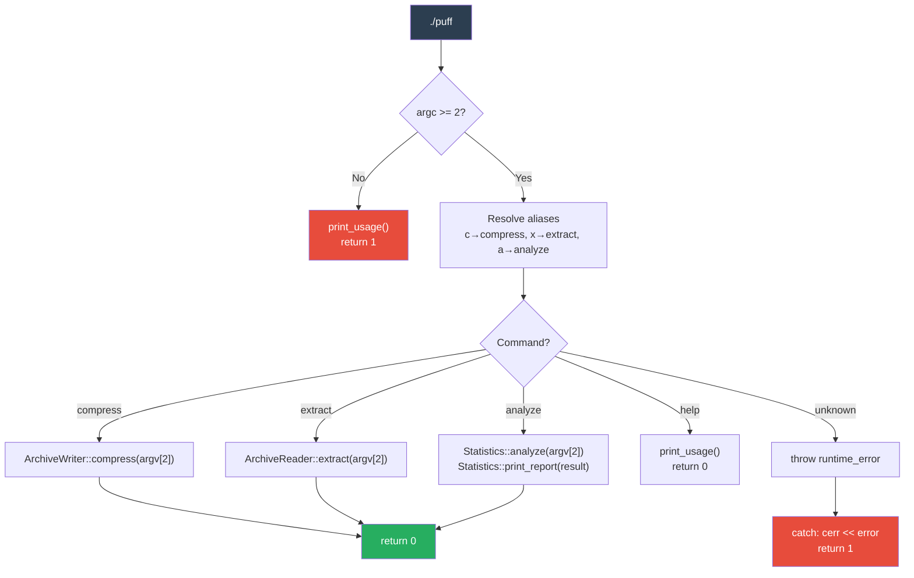

```cpp
int main(int argc, char* argv[]) {
    // argc = argument count, argv = array of C-strings
    // "./puff compress abracadabra.txt" → argc=3, argv=["./puff","compress","abracadabra.txt"]

    if (argc < 2) {
        pufferfish::print_usage(argv[0]);
        return 1;  // non-zero = error
    }

    std::string cmd = argv[1];
    if (cmd == "c") cmd = "compress";  // Shorthand alias
    if (cmd == "x") cmd = "extract";
    if (cmd == "a") cmd = "analyze";

    try {
        if (cmd == "compress") {
            if (argc < 3) throw std::runtime_error("Requires file argument");
            pufferfish::ArchiveWriter::compress(argv[2]);
            return 0;
        }
        // ... (extract, analyze, help — same pattern)
        throw std::runtime_error("Unknown command: " + cmd);
    } catch (const std::exception& e) {
        std::cerr << "Error: " << e.what() << "\n";
        return 1;
    }
}
```

**`try/catch`** — All errors from the modules below are caught here and displayed to the user via `stderr`.

**`R"(...)"` (in `print_usage`)** — Raw string literal (C++11). Multi-line without escape characters.

---

## 8. Mathematical Concepts in the Code

### Theory → Code Mapping Summary

| Mathematical Concept | Location | Function/Class | `"abracadabra"` Example |
| :--- | :--- | :--- | :--- |
| **Binary Tree** | `huffman.hpp` | `HuffmanNode` | 9 nodes, height 5 |
| **Min-Heap** | `huffman.cpp` | `std::priority_queue` in `build()` | c(1),d(1) extracted first |
| **Greedy Algorithm** | `huffman.cpp` | Loop `while (pq.size() > 1)` | 4 merge iterations |
| **Prefix-Free Code** | `huffman.cpp` | `generate_codes_impl()` | a=0, b=111 (unambiguous) |
| **Shannon Entropy** | `statistics.cpp` | `analyze()` | H = 2.04 bits/symbol |
| **Lossless Compression** | `archive.cpp` | Round-trip compress→extract | 11 bytes → 3 bytes → 11 bytes |
| **Information Encoding** | `huffman.cpp` | `Encoder::encode()` | 88 bits → 23 bits |
| **DFS Traversal** | `huffman.cpp` | `generate_codes_impl()` | Left=0, Right=1 |
| **Bitwise Operations** | `huffman.cpp` | `BitWriter`, `BitReader` | `(buffer << 1) \| bit` |
| **Binary Serialization** | `archive.cpp` | `write_u16()`, `read_u64()` | Little-endian |

### Visual Summary

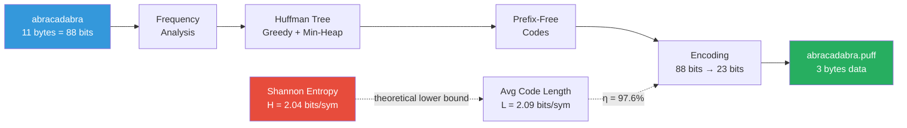

---

## 9. C++ Syntax Glossary

| Syntax | Standard | Explanation | Example in Project |
| :--- | :--- | :--- | :--- |
| `auto` | C++11 | Automatic type deduction | `auto cmp = [](...){}` |
| `[](auto& a){ ... }` | C++11/14 | Lambda expression | Comparator in `build()` |
| `std::unique_ptr<T>` | C++11 | Smart pointer with single ownership | `HuffmanNode::left`, `right` |
| `std::make_unique<T>(...)` | C++14 | Safely creates a unique_ptr | `pq.push(make_unique<...>(...))` |
| `std::move(x)` | C++11 | Transfers resource ownership | Moving nodes between trees |
| `const auto& [k, v]` | C++17 | Structured binding | `for (const auto& [sym, freq] : ...)` |
| `std::optional<T>` | C++17 | Type that can be empty | `BitReader::read_bit()` |
| `std::nullopt` | C++17 | "Empty" value for optional | Return on EOF |
| `[[nodiscard]]` | C++17 | Return value must be used | `is_leaf()`, `generate_codes()` |
| `constexpr` | C++11 | Compile-time evaluation | `PUFF_MAGIC` |
| `noexcept` | C++11 | Won't throw exceptions | `is_leaf()`, `height()` |
| `static_cast<T>(x)` | C++11 | Explicit safe type conversion | `char` ↔ `uint8_t` |
| `const_cast<T>(x)` | C++11 | Removes `const` qualifier | Move from `pq.top()` |
| `decltype(expr)` | C++11 | Gets the type of an expression | `decltype(cmp)` |
| `R"(...)"` | C++11 | Raw string literal (no escaping) | Help text in `main.cpp` |
| `namespace` | C++98 | Name grouping | `namespace pufferfish { }` |
| `std::filesystem::path` | C++17 | Cross-platform path representation | `compress()`, `extract()` params |
| `try/catch` | C++98 | Exception handling | `main()` |
| `#ifndef`/`#define`/`#endif` | C89 | Include guard | Every `.hpp` |
